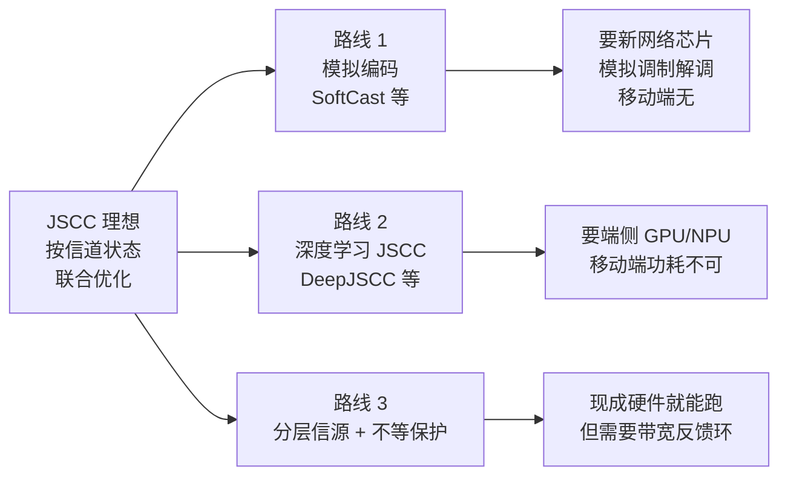
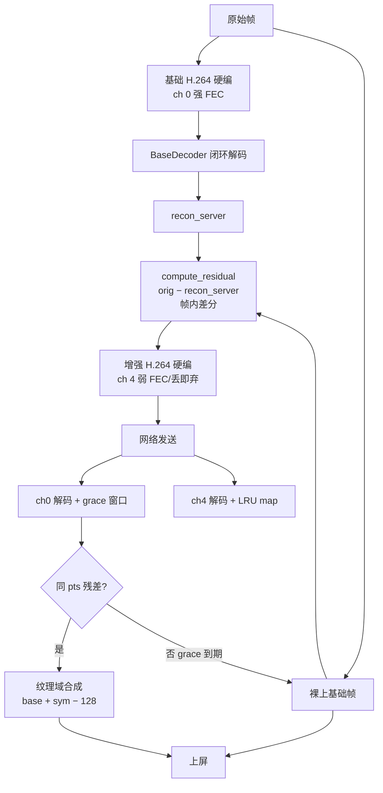
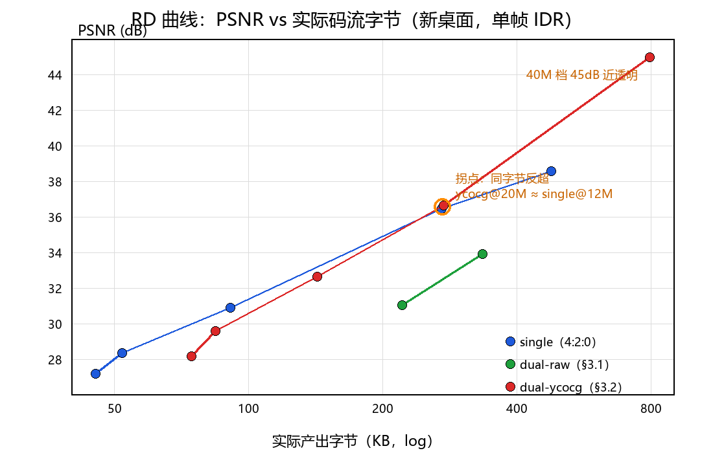

# 用现成芯片做 JSCC：分层 + 帧内差分 + 帧间优化

> 一篇工程实战总结。**JSCC（Joint Source-Channel Coding）**在信息论里被反复证明是低时延弱网下最优的编码范式，但过去被认为难落地——主流方案要么需要新设计网络芯片（模拟编码），要么需要端侧 GPU/NPU（深度学习 JSCC）。本文讲我们怎么在不改造芯片的前提下，用**两个现成的标准硬编器（H.264 / H.265 都支持，落地用 H.264）+ 软件 FEC + 简单的带宽反馈**，把 JSCC 跑在了手机和 PC 上。它适用的不只是手机投屏——**低时延直播 / 视频通话 / 云游戏 / 云桌面**都共享同一套思路。

---

## 一、JSCC 的「芯片困境」

### 1.1 为什么 Shannon 分离设计在实时系统下不够

经典 Shannon 告诉我们：信源编码（去冗余）+ 信道编码（加冗余），**两者独立优化、级联使用，可以无穷接近端到端最优**。前提是：

- 信源码长无限（渐进最优）
- 信道码长无限（误差指数趋于零）
- 端到端延迟无限（可以任意重传）

但实时系统的硬约束把这三条全部砍掉：

| 约束 | 实时业务取值 |
|---|---|
| 端到端延迟 | < 200 ms（最好 < 100 ms） |
| 单帧延迟 | < 50 ms |
| 缓冲深度 | 0~2 帧 |
| 重传深度 | 通常 0（最多 1） |

**有限码长 + 有限延迟 + 有限重传**之下，分离设计的最优解根本不存在。边界条件把 Shannon 的极限砍没了，剩下的就是：**链路一旦抖动，要么糊要么卡**。

### 1.2 JSCC 想做什么

JSCC 把信源和信道**联合优化**：给定信道状态，按端到端失真最小来分配信源码率和信道保护强度。直白点说：

> **信道好就少花保护、多花比特在信源上**（画质好）；**信道差就多花保护、甚至主动降低信源质量以维持稳定**（画质差但不断流）。

### 1.3 经典 JSCC 的三条路，为什么都「难落地」



**路线 1：模拟编码（SoftCast 等）**

- 直接把像素值（如 DCT 系数）做模拟调制，信道好 → 解调准 → 画质好；信道差 → 解调模糊 → 画质均匀退化。
- **优点**：天然连续可分级，零延迟，无 IDR 概念。
- **致命缺点**：**完全绕过数字压缩**——要新设计网络芯片（调制解调、数模转换），移动端 SoC 不可用。

**路线 2：深度学习 JSCC（DeepJSCC 等）**

- 把整个编解码器换成神经网络：发送端 encoder CNN，接收端 decoder CNN，**端到端训练**对抗 SNR。
- **优点**：对所有信道条件都自适应，性能超过分离设计 + BPG。
- **致命缺点**：要 GPU/NPU 推理（手机端 30 fps 难达成），模型大、功耗高，**移动端不可接受**。

**路线 3：分层信源 + 不等保护**

- 信源本身**分层**（基础层 + 增强层，H.264/SVC/双流都行）；
- 信道保护**按层分级**：基础层强保护（甚至强 FEC + 重传），增强层弱保护（甚至无 FEC、可丢）。
- **优点**：可用现成硬件（标准硬编 H.264 / H.265 + 软件 FEC），手机端可跑。
- **致命缺点**：要协调两条流的码率分配，依赖带宽估计精度——**光有分层不够，必须有实时带宽反馈**。

> 路线 3 的设想本身不新，过去没人把它做出来，是因为**第二条流需要「帧内差分 + 帧间优化」才有意义**，而这两个组合起来有大量工程坑。下面是我们的实现路径。

---

## 二、业界两条主流路径：DualStream 与 LCEVC

既然「分层信源 + 不等保护」是 JSCC 在现成硬件上的可行路线，**业界具体是怎么做的？** 三条主流路径正好可以拿来对照——其中第一条还是 H.264 标准本身就定义好的方案。

### 2.1 路径一：H.264 SVC（标准路线，最早的分层）

在视频编码领域，**真正基于「增强层残差平面」这个原理做分层的，恰恰就是 H.264 标准本身**——H.264 Annex G（Scalable Video Coding，SVC）。SVC 通过**层间预测（inter-layer prediction）**让增强层只编码与基础层的差异，形式上和我们的方案完全一致：

```
原始画面 ──┬──→ 基础层 H.264 编码 ──→ 基础层 H.264 流
           │
           └──→ (原始 − 基础层重建) = 残差
                  └──→ 增强层编码（依赖基础层做预测）──→ 增强层流
```

**标准化与可用性**：

- MPEG 标准（H.264 Annex G，2007 年），libavc（Google 开源 H.264 实现）包含完整 SVC 编解码器；
- Android 上可以用 `MediaCodecInfo.CodecCapabilities` 通过 `MediaCodecList` 查询设备是否支持 H.264 SVC——**有能力检测**，不代表有硬编可用；
- 学术界和标准化层面 SVC 早已成熟。

**现实限制**——三个核心问题决定了 SVC 至今未在实时业务里普及：

1. **硬编器普遍不支持**。**目前主流的硬件编码器都不支持 SVC 输出**——高通、联发科、海思、三星 Exynos 的硬编器都只输出标准 H.264/HEVC。要做 SVC，**只能使用软件编码器**（libavc、x264、openH264 等），CPU 占用高，效率比普通编码**低约 10%**，明显增加 CPU 负担，对手机端实时业务不友好。
2. **系统层支持有限**。SVC 在 Android 系统中被视为一个实验性或特定的功能——**Android 的 APEX（可更新系统组件）模块化方案中，明确将 SVC 相关的扩展库排除在外**，意味着它不会像基础 H.264 编码器那样作为一个标准、通用的系统组件提供给所有应用。开发者能用 libavc 软编，但和系统级硬编不在一个生态里。
3. **传输协议私有依赖**。标准 RTMP、WebRTC 不能直接传输 SVC 不同分层——**要拉取 SVC 的不同分层，通常依赖 ZEGO、声网等 SDK 的私有传输协议**，需要配合支持 SVC 的 SFU（Selective Forwarding Unit）才能实现。SVC 在编码层是标准，但在传输层是孤岛。

**结论**：SVC 是「分层残差」思想的标准实现，原理上和我们做的事情完全一致——**但落地的核心障碍是硬编器和协议层都不支持**。这就是为什么业界要么绕过它（DualStream），要么新做一套（LCEVC），要么用软件硬扛。

### 2.2 路径二：DualStream 大小流（商业绕过，最朴素）

既然 SVC 软编不行，那就用两个独立的硬编器——这是最朴素、最商业的思路：

- **基础流**：H.264 硬编器编码**低码率**的完整帧；
- **增强流**：另一个独立的 H.264 硬编器编码**高码率**的完整帧；
- 两条流通过协议层发送，**完全独立**——不共享运动矢量、不共享参考帧、不共享模式决策。

这是 ZEGO 即构 SDK、声网 Agora 部分方案采用的思路。**本质上是 JSCC 第三条路线的最简实现**——硬件编码器独立、可商用、不依赖 SVC 硬编。

**优点**：

- 部署简单（两个硬编器，不需要特殊支持）；
- 性能有保障（硬件加速）；
- 不依赖厂商支持（所有硬编器都能跑）。

**问题**：

- **压缩效率低**：两条流各压各的，基础流和增强流之间的冗余**完全没利用**——增强流不知道基础流已经压住了哪些信息，相当于把同一帧压了两遍；
- **协议层盲**：标准 DualStream 两条流走相同传输通道，**FEC 共享**——弱网下两条流一起糊；
- **上屏同步**：两条流时间戳必须严格对齐，客户端要自己做配对合成；业界多数 SDK 直接以「双流切换」的方式（选基础流还是增强流），**没做残差合成**——网络一切画面就跳。

### 2.3 路径三：LCEVC（MPEG-5 Part 2，新一代标准）

MPEG 在 2020 年发布了 **LCEVC（Low Complexity Enhancement Video Coding，低复杂度增强视频编码）**，正是为「分层 + 残差增强」专门设计的新一代标准，思路和 SVC 类似但工具更轻。

LCEVC 的核心思路：

```
原始画面（高分辨率，如 1080p）
  ├── 下采样 → 基础层编码器（H.264/HEVC 硬编）→ 基础层 H.264 流（如 540p）
  │
  ├── 基础层 H.264 流 → 解码 → 上采样 → 重建低分辨率
  │
  └── 原始画面 − 上采样重建 = 残差
        └── 增强层编码器（独立）→ 增强层流
```

**解码端**：

- 只解基础层：得到低分辨率画面；
- 解基础层 + 增强层：合成完整高分辨率画面；
- 增强层**可独立丢弃**（不影响基础层）。

LCEVC 的「标准贡献」在于**形式化了基础 + 残差的双流结构**，写进了 MPEG 标准。多厂商互通、工具链完整、增强层编码方式灵活。

**问题**：

- **核心问题：硬件不支持**。LCEVC 是 MPEG 在 2020 年发布的较新标准，**主流移动 SoC（高通、联发科、海思、三星 Exynos）的硬编器目前都不支持 LCEVC 输出**。要做 LCEVC，**只能走 CPU/软件实现**——1080p 60fps 的残差帧实时编码在 CPU 上跑 100+ ms，单帧延迟就垮了；这是 LCEVC 至今未大规模落地的根本原因；
- **基础层必须降分辨率**：LCEVC 强制「基础层 = 低分辨率、增强层 = 残差」。这意味着上采样这一步**不可避免**——上采样会带来振铃、锯齿，残差图会「长出」一层伪结构；
- **网络层规范不全**：LCEVC 标准只关注编码结构，**传输层怎么分通道、FEC 怎么配、断链怎么恢复，留给上层**——很多 LCEVC 集成商最终还是要自建传输协议。

### 2.4 我们与三条路径的关系：硬件友好的"残差分层"

把业界三条路径对照过来看：

- **和 SVC**：原理完全一致——层间预测 / 残差结构、增强层编码原始帧与基础层重建帧的差。SVC 之所以落不了地，不是因为原理不行，**是因为硬编器、传输协议、系统组件都不支持**。我们做的事情，本质上是 **「SVC 的思想 + 现成的硬编器」**——既然硬编不支持 SVC 输出，那就用两个普通 H.264 硬编器模拟 SVC 的语义；
- **和 DualStream**：硬件路线一致（两个 MediaCodec），但 DualStream 多数 SDK 没做残差合成，我们做了——基础帧先到先上屏、增强帧到了纹理域相加；
- **和 LCEVC**：残差结构一致，但 LCEVC 必须降分辨率+上采样，我们同分辨率+闭环解码，**无上采样失真**；
- **共同的差异化**：**把网络层集成进来**——三条路径的标准/SDK 都不管传输层怎么分通道、FEC 怎么配、带宽怎么反馈。我们把分层、不等保护、网络反馈环打包在一起。

一句话总结：

> **我们的方案 = 「SVC 思想」（残差分层）+「DualStream 硬件路线」（双硬编器）+「LCEVC 残差结构」的合成，再加上端到端的网络反馈层。** 既不依赖 SVC 硬编支持，也不引入上采样失真，还把网络自适应集成进协议层。

### 2.5 与业界对比：一张表看清

| 维度 | **H.264 SVC** | **DualStream** | **LCEVC** | **我们的方案** |
|---|---|---|---|---|
| **移动端硬编支持** | ❌ 主流硬编不支持（需软编） | ✅ 全部支持 | ❌ 主流硬编不支持（需软编） | ✅ **全部支持**（两个 MediaCodec） |
| 增强层编码内容 | 残差（同分辨率） | 完整高码率帧 | **上采样残差**（基础层需降分辨率） | **闭环残差**（同分辨率） |
| 残差计算基准 | 基础层重建 | — | 上采样重建 | **闭环解码重建（diff_bytes=0）** |
| 上采样失真 | 无 | 无 | **有**（振铃 / 锯齿） | 无 |
| 共享运动矢量 | **是**（层间预测） | 否 | 部分（基础层 MV 复用） | 否 |
| 增强层可独立丢弃 | 是 | 否（多数 SDK） | 是 | **是**（ch 4 FEC 显式关） |
| 传输层不等保护 | 标准未规定 | 否（共享通道） | 标准未规定 | **是**（ch 0 FEC on / ch 4 FEC off） |
| 网络自适应反馈 | 需 SFU 配合 | 需上层做 | 需上层做 | **集成在协议层** |
| 单帧硬编延迟（1080p） | **~30+ ms（软编）** | ~10 ms ×2 | 基础 ~10 ms + **增强 100+ ms（CPU 软跑）** | **~10 ms ×2（全硬编）** |
| 系统组件支持 | APEX 明确排除 | 标准 MediaCodec | 标准 MediaCodec | 标准 MediaCodec |
| 传输协议兼容性 | 私有协议 / SFU | 私有 / 标准 | 私有 / 标准 | **任意支持 UDP 的传输** |
| 标准化 | H.264 Annex G 标准 | 各厂商私有 | MPEG-5 Part 2 标准 | 未标准化（单一实现） |

**关键观察**：

- **SVC** 最标准但硬编不支持、协议依赖私有 → **原理正确但落不了地**；
- **DualStream** 最朴素但没残差合成 → **能跑但不优雅**；
- **LCEVC** 是新一代标准但同样硬件不支持 → **未来可期但现在不能跑**；
- **我们** 在没有专用硬编芯片的当下，把 SVC 思想用两个普通硬编器落地——**「今天任何一台手机、PC 都能跑」**。

---

## 三、核心思路：三层组合跑在现成芯片上

我们做的事情可以拆成三层：

| 层 | 做什么 | 跑在什么硬件上 |
|---|---|---|
| **分层** | 基础流（ch 0）+ 增强层残差（ch 4），两个独立硬编 | 标准硬编器（H.264 / H.265），MediaCodec / oneVPL |
| **帧内差分** | 当前帧内像素级差分（残差） | CPU native，8–9 ms / 帧 |
| **帧间优化** | 相邻帧残差天然稀疏 + 闭环解码 | CPU + 硬编器 |
| **带宽反馈** | 实时感知带宽、动态拆码率 | 传输层 + 编码器联动 |

整体形态：



**两个关键设计**：

1. **闭环残差**：增强层的差分基准不是原始帧，而是**基础层本地解码后的重建帧**。这保证了 server 算出的残差与 client 收到的合成结果严格对齐——实测两端重建帧 `diff_bytes = 0`。
2. **两条独立流**：基础层和增强层走**两个独立编码器 + 两个独立传输通道**，断链 / 重传 / 丢包**互不污染**。这让我们可以**关掉增强层的 FEC**（让校验字节给基础层），同时让两条流各自有独立的恢复命令（`REQ_KEYFRAME` / `REQ_ENH_KEYFRAME`）。

下面进入重点：**差分到底怎么做**。

---

## 三、帧内差分：怎么算出残差（核心代码）

### 3.1 直偏置残差——线上方案

残差的定义非常朴素：

```
sym[i] = clamp(orig[i] − recon[i], −128, 127) + 128    ∈ [0,255]
```

- **`orig`**：当前帧的原始像素（I420 planar）；
- **`recon`**：基础层**闭环解码后的重建帧**（H.264 解码输出）；
- **`+128`**：把范围 `[-128, 127]` 平移到 `[0, 255]`，让 I420 像素格式直接容纳（避免负值在硬编器里的奇怪行为）。

实际代码（`shared/layered/residual.cpp`）：

```cpp
// residual.cpp:9-13
inline std::uint8_t clamp_sym(int d) {
    if (d < -128) d = -128;
    if (d > 127)  d = 127;
    return (std::uint8_t)(d + 128);
}

// residual.cpp:17-51 — Y 平面 + U/V 平面分别处理
void compute_residual(const std::uint8_t* orig, int w, int h,
                      const std::uint8_t* ry, int y_stride, int y_ps,
                      const std::uint8_t* ru, int u_stride, int u_ps,
                      const std::uint8_t* rv, int v_stride, int v_ps,
                      std::uint8_t* sym_out) {
    // Y 平面（全分辨率）
    for (int y = 0; y < h; ++y) {
        const std::uint8_t* o = orig + (std::size_t)y * w;
        const std::uint8_t* r = ry  + (std::size_t)y * y_stride;
        std::uint8_t* s = sym_out   + (std::size_t)y * w;
        if (y_ps == 1) {
            for (int x = 0; x < w; ++x)
                s[x] = clamp_sym((int)o[x] - (int)r[x]);
        } else {
            for (int x = 0; x < w; ++x)
                s[x] = clamp_sym((int)o[x] - (int)r[(std::size_t)x * y_ps]);
        }
    }
    // U/V 平面（1/4 分辨率，逐像素 PS 寻址）
    const int cw = w / 2, ch = h / 2;
    const std::uint8_t* ou = orig + (std::size_t)w * h;
    const std::uint8_t* ov = ou  + (std::size_t)cw * ch;
    std::uint8_t* su = sym_out  + (std::size_t)w * h;
    std::uint8_t* sv = su       + (std::size_t)cw * ch;
    for (int y = 0; y < ch; ++y) {
        // ... 同上，逐像素 clamp_sym(our - ruw) / clamp_sym(ovr - rvw)
    }
}
```

**几个细节值得讲**：

1. **`y_ps == 1` 分支**：Y 平面通常是紧凑排列（pixel stride=1）；`else` 分支处理 NV12 / NV21 半平面交错（pixel stride=2）。
2. **`+128` 偏置**：所有差分值都加 128，**`128 = 零残差`**，也就是「基础层重建像素和原始像素完全相同」时增强层传的全零图。
3. **clamp 到 `[-128, 127]`**：8 位像素差分天然就在这个区间，无需额外限幅，但显式 clamp 让代码语义清晰。

客户端合成公式（`shared/layered/residual.cpp:53-62`）：

```cpp
void apply_residual(const std::uint8_t* base, const std::uint8_t* sym,
                    int w, int h, std::uint8_t* out) {
    const std::size_t n = frame_bytes(w, h);
    for (std::size_t i = 0; i < n; ++i) {
        int v = (int)base[i] + (int)sym[i] - 128;   // 反偏置
        if (v < 0)   v = 0;
        if (v > 255) v = 255;
        out[i] = (std::uint8_t)v;
    }
}
```

实际生产环境客户端**在 GL 着色器里做这个相加**（纹理域相加，省一次 CPU 拷贝）：

```glsl
if (has_res != 0) {
    yv = clamp(yv + texture2D(res_y, v_tex).r - 0.5, 0.0, 1.0); // BIAS = 128/255
    c.r = clamp(c.r + rc.r - 0.5, 0.0, 1.0);
    c.a = clamp(c.a + rc.a - 0.5, 0.0, 1.0);
}
```

### 3.2 试错的反面教材：水平一阶差分伪装（camo，已弃用）

我们最初试过一种方案：**先对残差做水平一阶差分，让它看起来更像自然图像**，再让硬编器压。代码（`shared/layered/camouflage.cpp:11-24`）：

```cpp
// 单平面逐行模 256 一阶差分：d[0] = s[0]，d[i] = (s[i] − s[i−1]) & 0xFF
void diff_rows(const std::uint8_t* in, std::uint8_t* out, int width, int rows) {
    for (int r = 0; r < rows; ++r) {
        const std::uint8_t* s = in + (std::size_t)r * width;
        std::uint8_t* d = out + (std::size_t)r * width;
        std::uint8_t prev = s[0];
        d[0] = prev;
        for (int x = 1; x < width; ++x) {
            std::uint8_t cur = s[x];
            d[x] = (std::uint8_t)((cur - prev) & 0xFF);
            prev = cur;
        }
    }
}

// 反向 = 逐行前缀和（mod 256）
void sum_rows(const std::uint8_t* in, std::uint8_t* out, int width, int rows) {
    for (int r = 0; r < rows; ++r) {
        const std::uint8_t* d = in + (std::size_t)r * width;
        std::uint8_t* s = out + (std::size_t)r * width;
        int acc = 0;
        for (int x = 0; x < width; ++x) {
            acc = (acc + d[x]) & 0xFF;
            s[x] = (std::uint8_t)acc;
        }
    }
}
```

直觉上很美：残差是「零均值类噪声」，差分后更平滑、能量更集中在低频，硬编器应该更喜欢它。**实测完全相反**：

| 基础层 | 增强方式 | 增强码率 | 增强字节 | 总字节 | PSNR (dB) | SSIM |
|---|---|---|---|---|---|---|
| 4 M | （无增强） | — | 0 | 50 K | 28.35 | 0.8354 |
| 4 M | **direct**（直偏置） | 8 M | 170 K | 221 K | **34.57** | **0.9451** |
| 4 M | **camo**（水平差分） | 8 M | **1053 K** | 1103 K | **9.09** | **0.0647** ❌ |

视觉对比（同一张桌面截图，8M 增强层）：

| 方案 | 画面 |
|---|---|
| direct（线上方案） |  |
| camo（已弃） |  |

camo 出来的图肉眼可见条纹污染，PSNR 反而掉到 9 dB——**比不加增强层还差**。为什么：

1. **残差本来就是类白噪声**（高频能量均匀），差分会把高频能量**白化**、压成更强的噪声，H.264 反而堆更多比特；
2. **一阶差分是有记忆的**（`out[i] = sym[i] − sym[i-1]`），加上 H.264 有损编码 + 行内边界，**行内误差累积**，肉眼可见条纹。

反面教材留下的两个工程教训：

- **不要为了「让编码器更舒服」而改造输入分布**——残差本来就是无结构的，硬塞结构会反过来惩罚你；
- **RD 效率不能脱离工程直觉单独看**——理论上更优的方案，在硬编 + 有损链路上可能反向。

### 3.3 帧间优化：相邻帧的天然压缩

「帧内差分」是同一帧内、当前像素和基础层重建像素的差。但**更强的压缩来自帧间**——相邻帧的残差天然稀疏。

**为什么稀疏**：相邻 16-30 ms 的两帧之间，屏幕大部分像素是**不变**的（背景、静态 UI、文本），只有局部运动区域有残差。增强层的「直偏置残差图」里，绝大部分区域是**常数 128（零残差）**，H.264 直接以「平坦区」压——**巨省比特**。

帧间优化在三个层面发生：

1. **基础层自身的运动补偿**：H.264 硬编器天然做——P 帧的 inter prediction 用前一帧做运动搜索，运动矢量编码天然压缩帧间冗余。
2. **增强层的残差天然稀疏**：因为基础层已经压住了大部分帧间冗余，残差只剩「基础层 P 帧没压住的细节」（如运动补偿失败的边界、运动模糊的细节）。
3. **闭环残差保证对齐**：基础层闭环解码 → 重建帧 → 残差。客户端合成 `base + sym − 128 = orig` 严格成立。**帧间没有累积漂移**。

实测下来 886×1920 @ SD865 一帧残差计算 **8-9 ms**（CPU native），增强层编码 ~10 ms（硬编），整链路稳态可跑到 30 fps。

---

## 四、GPU 残差合成：客户端怎么在 GPU 上做"base + sym"

帧内差分算出残差只是「server 端」的事。**客户端要把基础层重建 + 残差合成回原始像素**——这一步在 1080p @ 60 fps 下意味着每秒处理约 **1.24 亿像素**，每像素至少一次 Y 加法 + 一次 UV 加法 + 一次 clamp + 一次 BT.601 反变换。这一步**必须在 GPU 上做**。

### 4.1 为什么必须在 GPU 上做（时延账）

放在 CPU 上做的开销：

- CPU 主频高但带宽吃紧——1080p 一帧 4 MB 基础纹理 + 4 MB 残差纹理，加法后再 4 MB 写回，**单帧 memcpy+add 至少 8 ms**（SD865 实测）；
- **这 8 ms 是额外的上屏延迟**——叠加到解码 7.5 ms 后变成 15.5 ms，60 fps 已经只剩 1 ms 余量，触控、UI、其他线程全要挤这 1 ms；
- **CPU 上做不现实**。

放在 GPU 上做的优势：

- **并行度高**：1080p 一帧 2073600 像素，几百个 shader 核心并行算，**每像素开销 < 1 ns**；
- **带宽就地**：基础 + 残差两个纹理采样、一次纹理写回（framebuffer），**不需要中间 CPU 拷贝**；
- **零额外延迟**：上屏流程就是「上传纹理 → 一次 `drawArrays` → 显示」，GPU 在 draw call 内部完成合成；
- **现成硬件**：GLES 2.0 是 Android 1.0 时代就支持的 API，**所有 Android 设备都能跑**（最低 API level 8，Android 2.2，2010 年的设备都能跑），不需要 Vulkan/Metal/OpenCL。

> **时延账**：1080p 60fps = 16.6 ms / 帧。CPU 合成吃掉 8 ms 意味着总延迟立刻 +50%；GPU 合成只占 0.5-1 ms（draw call + GPU 内并行），**几乎免费**。**GPU 合成让分层方案的时延预算成立**——CPU 做这步，整个分层架构的时延优势归零。

### 4.2 完整 GLSL ES 2.0 着色器实现

下面是线上跑的着色器完整实现（`client-android/jni/renderer.cpp`），它在**一个 draw call 里**完成：

- Y 平面采样 + UV 半分辨率采样
- 「base + sym − 128/255」残差相加
- BT.601 limited range → 线性 RGB 反变换

```glsl
// === 顶点着色器（极简：传位置 + 纹理坐标） ===
attribute vec4 a_pos;
attribute vec2 a_tex;
varying vec2 v_tex;
void main() {
    gl_Position = a_pos;
    v_tex = a_tex;
}
```

```glsl
// === 片段着色器（所有像素并行执行） ===
precision mediump float;

uniform sampler2D tex_y;   // 基础 Y 平面（single: W×H）
uniform sampler2D tex_uv;  // 基础 UV 平面（NV12 交错，luminance=U alpha=V）
uniform sampler2D res_y;   // 残差 Y（128/255 = 零残差）
uniform sampler2D res_uv;  // 残差 UV（同布局）
uniform vec2 logical_size; // 逻辑帧尺寸 (W, H)
uniform int mode;          // 0=double-raw 1=double-ycocg 2=single-bt601
uniform int has_res;       // 1 = 当前帧有残差
varying vec2 v_tex;

const float BIAS = 128.0 / 255.0;

void main() {
    float W = logical_size.x;
    float H = logical_size.y;
    vec2 p = min(floor(v_tex * logical_size), logical_size - 1.0);

    if (mode == 2) {
        // ===== single BT.601 路径 =====
        vec2 y_step  = vec2(1.0 / W, 1.0 / H);
        float yv = texture2D(tex_y, (p + 0.5) * y_step).r;

        vec2 blk = floor(p * 0.5);
        vec2 uv_step = vec2(2.0 / W, 2.0 / H);
        vec4 c = texture2D(tex_uv, (blk + 0.5) * uv_step);

        // ===== 残差合成（核心：clamp(base + sym − 128/255)）=====
        if (has_res != 0) {
            yv = clamp(yv + texture2D(res_y, (p + 0.5) * y_step).r - BIAS, 0.0, 1.0);
            vec4 rc = texture2D(res_uv, (blk + 0.5) * uv_step);
            c.r = clamp(c.r + rc.r - BIAS, 0.0, 1.0);
            c.a = clamp(c.a + rc.a - BIAS, 0.0, 1.0);
        }

        // ===== limited range → 线性 RGB =====
        float Y = (yv - 16.0 / 255.0) * (255.0 / 219.0);
        float U = (c.r - BIAS) * (255.0 / 224.0);
        float V = (c.a - BIAS) * (255.0 / 224.0);
        gl_FragColor = vec4(
            Y + 1.596 * V,
            Y - 0.813 * V - 0.391 * U,
            Y + 2.018 * U,
            1.0
        );
    }
    // mode 0/1（double-raw / double-ycocg）路径同形式，省略
}
```

### 4.3 几个关键设计

**1) texel center 采样防串色**

```glsl
// 用 NEAREST 采样 + texel center (p + 0.5) 防插值串色
glTexParameteri(GL_TEXTURE_2D, GL_TEXTURE_MIN_FILTER, GL_NEAREST);
glTexParameteri(GL_TEXTURE_2D, GL_TEXTURE_MAG_FILTER, GL_NEAREST);
texture2D(tex_y, (p + 0.5) * y_step).r
```

`v_tex` 是顶点插值后的纹理坐标（带小数），直接采样会触发线性插值，**相邻像素会串色**——文字边缘、图标轮廓立刻变模糊。所以先 `floor(p)` 取整到 texel，再 `(p + 0.5) * step` 转成纹理坐标。这是屏幕内容渲染的硬约束。

**2) Y 全分辨率，UV 半分辨率**

NV12 布局里 U/V 是 2×2 块共享一个值（4:2:0 subsampling），所以 UV 纹理尺寸是 `(W/2, H/2)`：

```glsl
vec2 blk = floor(p * 0.5);  // 当前像素属于哪个 2×2 块
texture2D(tex_uv, (blk + 0.5) * uv_step)
```

一个 `vec4 c` 同时拿到 U 和 V——`c.r` 是 luminance（U 通道）、`c.a` 是 alpha 通道（V 通道）。NV12 实际只有 R+A 两个通道有意义。

**3) `has_res` 动态分支**

```glsl
if (has_res != 0) { ... }
```

大多数帧**没有残差追上**（基础帧先到、增强层没赶上就裸上）。shader 里多一个分支就够了——没分支就完全不采样残差纹理，**零开销**。GPU 的 dynamic branch 在同一 warp 内所有像素同分支时几乎没有 cost。

**4) BIAS = 128/255 = 0.5020**

直偏置残差的偏置常数 128 在 0-255 像素空间里是中间值。GLSL 里浮点运算时归一化到 0-1，**所以 BIAS 是 128.0/255.0**（约 0.5020）。合成时减 BIAS 还原到「无偏置空间」，clamp 到 [0,1]。

**5) BT.601 limited range 反变换**

```glsl
Y = (yv - 16.0/255.0) * (255.0/219.0);  // 16-235 → 0-1
U = (c.r - BIAS)   * (255.0/224.0);     // 中心 128，幅度 ±112
V = (c.a - BIAS)   * (255.0/224.0);
R = Y + 1.596 * V
G = Y - 0.813 * V - 0.391 * U
B = Y + 2.018 * U
```

**每像素 ~6 个 FLOP**。1080p 60 fps 意味着每帧 ~12 亿 FLOP——当代手机 GPU（Adreno/Mali）单帧 < 0.5 ms 跑完。

### 4.4 纹理上传：CPU → GPU 的零拷贝

shader 写完了，数据怎么进 GPU？看纹理上传代码（`renderer.cpp::upload_textures`）：

```cpp
void Renderer::upload_textures(const VideoFrame& f, bool resize) {
    glPixelStorei(GL_UNPACK_ALIGNMENT, 1);
    
    // 单元 0：基础 Y（GL_LUMINANCE 单通道）
    glActiveTexture(GL_TEXTURE0);
    glBindTexture(GL_TEXTURE_2D, m_tex_y);
    if (resize) {
        glTexImage2D(GL_TEXTURE_2D, 0, GL_LUMINANCE, f.width, f.height, 0,
                     GL_LUMINANCE, GL_UNSIGNED_BYTE, f.y.data());
    } else {
        glTexSubImage2D(GL_TEXTURE_2D, 0, 0, 0, f.width, f.height,
                        GL_LUMINANCE, GL_UNSIGNED_BYTE, f.y.data());
    }
    
    // 单元 1：基础 UV（GL_LUMINANCE_ALPHA，NV12 交错）
    glActiveTexture(GL_TEXTURE1);
    glBindTexture(GL_TEXTURE_2D, m_tex_uv);
    glTexSubImage2D(GL_TEXTURE_2D, 0, 0, 0, f.width / 2, f.height / 2,
                    GL_LUMINANCE_ALPHA, GL_UNSIGNED_BYTE, f.uv.data());
    
    // 单元 2/3：残差（只在 has_residual 时上传）
    if (f.has_residual) {
        glActiveTexture(GL_TEXTURE2);
        glBindTexture(GL_TEXTURE_2D, m_res_y);
        glTexSubImage2D(GL_TEXTURE_2D, 0, 0, 0, f.width, f.height,
                        GL_LUMINANCE, GL_UNSIGNED_BYTE, f.res_y.data());
        
        glActiveTexture(GL_TEXTURE3);
        glBindTexture(GL_TEXTURE_2D, m_res_uv);
        glTexSubImage2D(GL_TEXTURE_2D, 0, 0, 0, f.width / 2, f.height / 2,
                        GL_LUMINANCE_ALPHA, GL_UNSIGNED_BYTE, f.res_uv.data());
    }
}
```

**几个工程细节**：

- **`UNPACK_ALIGNMENT = 1`**：默认是 4，行字节不是 4 倍数时会跳字节。I420/NV12 行字节一般不是 4 倍数，**必须显式置 1**；
- **`GL_LUMINANCE`（单通道）**：`tex_y` 是单字节 Y 平面，用 `GL_LUMINANCE` 内部格式（自动归一化到 [0,1]），**省一半纹理内存和带宽**；
- **`GL_LUMINANCE_ALPHA`（双通道）**：`tex_uv` 用 L+A 复用 NV12 交错布局（U 在 L 通道、V 在 A 通道），**一个纹理两个通道**，不用两次 bind；
- **`glTexSubImage2D` vs `glTexImage2D`**：尺寸不变时用 `Sub`（只更新像素、不重建存储），**比 `glTexImage2D` 快 2-3 倍**；
- **残差独立尺寸**：注意 `m_res_w/m_res_h` 单独跟踪，不和 `m_tex_w/m_tex_h` 共用——这是踩过的坑（如果共用，残差帧同尺寸时永远走 `Sub` 而没有先 `Image2D` 分配，`Sub` 静默失败 → shader 采到未定义内容 → 闪红）。

### 4.5 一次 draw call 完成合成

`on_draw_frame` 是 GL 线程的渲染入口：

```cpp
void Renderer::on_draw_frame() {
    glViewport(0, 0, m_view_w, m_view_h);
    glClearColor(0.f, 0.f, 0.f, 1.f);
    glClear(GL_COLOR_BUFFER_BIT);

    VideoFrame frame;
    bool dirty = false;
    { std::lock_guard<std::mutex> lk(m_frame_mtx);
      if (m_frame_dirty && m_has_frame && m_frame.width > 0
              && !m_frame.y.empty() && !m_frame.uv.empty()) {
          frame = m_frame;
          m_frame_dirty = false;
          dirty = true;
      }
    }
    if (dirty) {
        bool resize = (frame.width != m_tex_w || frame.height != m_tex_h);
        upload_textures(frame, resize);
        m_tex_w = frame.width;
        m_tex_h = frame.height;
        m_mode = frame.single ? 2 : (frame.ycocg ? 1 : 0);
        m_frame_has_res = frame.has_residual;
    }

    glUseProgram(m_program);
    glUniform2f(m_u_logical_size, (float)lw, (float)lh);
    glUniform1i(m_u_mode, m_mode);
    glUniform1i(m_u_has_res, m_frame_has_res ? 1 : 0);
    glActiveTexture(GL_TEXTURE0); glBindTexture(GL_TEXTURE_2D, m_tex_y);
    glActiveTexture(GL_TEXTURE1); glBindTexture(GL_TEXTURE_2D, m_tex_uv);
    glActiveTexture(GL_TEXTURE2); glBindTexture(GL_TEXTURE_2D, m_res_y);
    glActiveTexture(GL_TEXTURE3); glBindTexture(GL_TEXTURE_2D, m_res_uv);
    glActiveTexture(GL_TEXTURE0);

    const float verts[] = {x0, y1, x1, y1, x1, y0, x0, y0};
    const float texs[]  = {0.f, 0.f, 1.f, 0.f, 1.f, 1.f, 0.f, 1.f};
    GLint a_pos = glGetAttribLocation(m_program, "a_pos");
    GLint a_tex = glGetAttribLocation(m_program, "a_tex");
    glEnableVertexAttribArray(a_pos);
    glEnableVertexAttribArray(a_tex);
    glVertexAttribPointer(a_pos, 2, GL_FLOAT, GL_FALSE, 0, verts);
    glVertexAttribPointer(a_tex, 2, GL_FLOAT, GL_FALSE, 0, texs);
    glDrawArrays(GL_TRIANGLE_FAN, 0, 4);   // ← 一次绘制，全屏所有像素并行算
    glDisableVertexAttribArray(a_pos);
    glDisableVertexAttribArray(a_tex);
}
```

**关键**：

- **「frame 数据 → 屏幕像素」之间只隔一个 `glDrawArrays`**——1080p 一帧 207 万像素在 GPU 内并行执行片段着色器，**单帧 GPU 时间 < 1 ms**；
- **零中间拷贝，没有 CPU 端 `apply_residual` 调用**——`apply_residual` 那个 CPU 实现只用于 host 单测和调试；
- **`glDrawArrays(TRIANGLE_FAN, 0, 4)`**：一个四边形铺满整个视口，**所有像素走同一个片段程序**——没有顶点变换、没有顶点缓冲、4 个顶点搞定全屏；
- **纹理懒绑定**：只有 `dirty` 才上传，稳态下每帧只 bind 不上传——**bind 是 GPU 命令，CPU 端开销几乎为零**。

### 4.6 为什么用 GLES 2.0 而不是 Vulkan/Metal

落地考量：

| API | Android 覆盖 | GPU 性能 | 学习成本 | 结论 |
|---|---|---|---|---|
| **GLES 2.0** | **100%**（API level 8+） | 足够 | 低 | **选这个** |
| GLES 3.0 | ~99% | 多 compute | 中 | 用 3.0 做合成浪费 |
| Vulkan | ~75% | 极强 | 极高 | **杀鸡用牛刀** |
| Metal | iOS only | 极强 | — | Android 用不到 |

GLES 2.0 已经能完成合成需要的全部能力：

- 多纹理采样（4 个纹理单元，足够 Y/UV/resY/resUV）
- 浮点精度（`precision mediump float`，shader 系数 1.596 等用 mediump 够用）
- 整数 uniform（`uniform int has_res`）
- 简单分支（`if (has_res != 0)`）

**不需要 GLES 3.0 的 MRT、不需要 compute shader、不需要 transform feedback**——合成是 1-pass 像素处理，GLES 2.0 完美。**写一次 shader，所有 Android 设备都跑**——这就是「用现成芯片做 JSCC」最重要的落地条件。

### 4.7 完整的上屏时延账

GPU 合成后的上屏时延（1080p 60fps，SD865 实测）：

```
┌────────────────────────────────────────────────────────┐
│ frame 数据准备（解码线程，并行）                            │
│  - ch0 H.264 硬解到 YUV： 7.5 ms                         │
│  - ch4 H.264 硬解到残差： ~7.5 ms（独立解码线程并行）       │
│  - grace 等待配对：      0~150 ms                        │
└────────────────────────────────────────────────────────┘
                          ↓
┌────────────────────────────────────────────────────────┐
│ GL 纹理上传（GL 线程）                                    │
│  - 4 个纹理 glTexSubImage2D：~1 ms                       │
│    （稳态不重建，只更新像素）                              │
└────────────────────────────────────────────────────────┘
                          ↓
┌────────────────────────────────────────────────────────┐
│ GPU 合成（GPU 内并行）                                    │
│  - drawArrays + 片段着色器：< 1 ms                       │
│  - 207 万像素 × 6 FLOP ÷ GPU 算力 ≈ 0.3 ms             │
└────────────────────────────────────────────────────────┘
                          ↓
                       显示
```

**GPU 合成只占 0.5~1 ms**——是上屏延迟里最小的一环。**CPU 端零开销是分层方案时延优势的关键**——这 8 ms 留出来给基础层 H.264 解码都够用。

---

## 五、帧间优化（再展开）

回到「帧内差分」的姐妹问题——帧间优化。

**为什么残差天然稀疏**：相邻 16-30 ms 的两帧之间，屏幕大部分像素是**不变**的（背景、静态 UI、文本），只有局部运动区域有残差。增强层的「直偏置残差图」里，绝大部分区域是**常数 128（零残差）**，H.264 直接以「平坦区」压——**巨省比特**。

帧间优化在三个层面发生：

1. **基础层自身的运动补偿**：H.264 硬编器天然做——P 帧的 inter prediction 用前一帧做运动搜索，运动矢量编码天然压缩帧间冗余。
2. **增强层的残差天然稀疏**：因为基础层已经压住了大部分帧间冗余，残差只剩「基础层 P 帧没压住的细节」（如运动补偿失败的边界、运动模糊的细节）。
3. **闭环残差保证对齐**：基础层闭环解码 → 重建帧 → 残差。客户端合成 `base + sym − 128 = orig` 严格成立。**帧间没有累积漂移**。

实测下来 886×1920 @ SD865 一帧残差计算 **8-9 ms**（CPU native），增强层编码 ~10 ms（硬编），整链路稳态可跑到 30 fps。

---

## 六、不同场景怎么适配

分层 + 帧内差分 + 帧间优化这一套，**不是手机投屏独有的**。下面四个场景都共享同一个 JSCC 形态，但侧重点不同。

### 6.1 低时延通话

**特点**：画面小（360p~540p），面部为主，码率敏感。

| 项 | 配置倾向 |
|---|---|
| 分辨率 | 360p / 540p |
| 基础层码率 | 500 kbps ~ 1.5 Mbps |
| 增强层码率 | 0 ~ 500 kbps（弱网时常关） |
| 帧率 | 24-30 fps |
| 上屏 grace | 80-120 ms（短） |

**为什么分层还值得做**：

- **网络抖动是最大杀手**：通话端常在 4G/5G 切换、WiFi 漫游，链路带宽波动剧烈；
- **基础层保"嘴形对齐"**：嘴形稍微糊没关系，卡顿才要命；
- **增强层补"皮肤纹理 / 头发"**：带宽富裕时画质上限更高。

实际通话场景下**增强层经常不合成**——基础层 1 Mbps 已经能保证可交互，弱网下还不如把码率全给基础层保流畅。

### 6.2 低时延直播

**特点**：上行带宽敏感，观众多，对延迟容忍稍高（1-3 s）。

| 项 | 配置倾向 |
|---|---|
| 基础层码率 | 1 ~ 3 Mbps |
| 增强层码率 | 1 ~ 4 Mbps |
| 帧率 | 30 fps（游戏直播可 60 fps） |
| 上屏 grace | 150-300 ms（允许稍长） |

**为什么分层特别值得**：

- **上行带宽是天价**：主播端 4G 上行常常只有 5-10 Mbps，单流要么糊要么卡；
- **观众端网络多样**：5G/WiFi/4G/3G 混杂，弱网比例高；
- **分层让"上行总码率"自适应**：基础层最少 1 Mbps（流畅底线），剩余给增强层；
- **观众各自按链路选层**：强网端合成、弱网端裸上基础。

实际直播场景下，**基础层可以走 CDN + 增强层走 P2P/专线**，把成本做差异化。

### 6.3 云游戏

**特点**：操作密集（每帧都在变）、延迟极敏感（< 80 ms）。

| 项 | 配置倾向 |
|---|---|
| 分辨率 | 720p / 1080p |
| 基础层码率 | 2 ~ 5 Mbps |
| 增强层码率 | 1 ~ 3 Mbps |
| 帧率 | 60 fps（硬指标） |
| 上屏 grace | **50-80 ms（极短）** |

**为什么分层仍然能贡献**：

- **流畅比画质重要 100 倍**：60 fps 的低画质 vs 30 fps 的高画质，永远选前者；
- **基础层必须保 60 fps**：单流编码如果码率偏高，单帧编码时间就拉满到 16 ms，**没有给增强层的余地**；
- **分层让基础层「能省就省」**：基础层只压到「能看清操作」的最低画质，**省下来的时间/码率全给增强层补静态背景细节**。

云游戏里**关键是 grace 窗口要短**——50-80 ms 的 grace，对应增强层追上的概率不高，但偶尔追上时画面质量有显著提升（静态背景从「能看清」变成「细腻」）。云游戏的 JSCC 价值在于**「能省则省，省下来的补背景」**。

### 6.4 云桌面

**特点**：内容最复杂（屏幕、文字、滚动、图标、视频），延迟容忍中等（< 150 ms）。

| 项 | 配置倾向 |
|---|---|
| 分辨率 | 1080p / 1440p / 4K |
| 基础层码率 | 3 ~ 8 Mbps |
| 增强层码率 | 5 ~ 15 Mbps |
| 帧率 | 30-60 fps |
| 上屏 grace | 100-200 ms |

**为什么分层优势最大**：

- **屏幕内容是 JSCC 的最优场景**：屏幕里有大块平坦区（白底、纯色背景）→ 帧内差分几乎全零；有大块静态文字 → 帧间残差几乎全零；有局部滚动 → 只有滚动区域有残差；
- **分层让"文本可读"和"画质细腻"解耦**：基础层 4 Mbps 已经能让 1080p 文字清晰可读（人眼对文字边缘的容忍度极高），增强层 8 Mbps 补图标边缘 / 颜色渐变 / 抗锯齿；
- **弱网下退化方式是"自然"**：基础层 1 Mbps 还能看文字，只是糊了图标——比单流从 12 Mbps 突降到 2 Mbps 的整帧糊**观感好太多**。

云桌面是这套方案的**最理想战场**——内容静态占比高、残差天然稀疏、用户对「流畅 + 可读」的要求严苛但对「画质上限」宽容。**这里 JSCC 的价值是「弱网下还能办公」**。

### 6.5 场景对比

| 场景 | 分层必要性 | 基础层优先级 | grace 窗口 | 增强层价值 |
|---|---|---|---|---|
| 低时延通话 | 中 | 最高 | 短 | 补皮肤纹理 |
| 低时延直播 | 高 | 高 | 中 | 弱网分化 |
| 云游戏 | 中 | **最高**（60 fps 硬指标）| **极短** | 补静态背景 |
| 云桌面 | **最高** | 高 | 中 | **核心价值**（文字可读） |

---

## 七、网络怎么配合：一句话原理

传输层要做的事情，归根结底只有一件事：

> **链路变了 → 估出新带宽 → 拆给基础和增强 → 出站按层优先级丢 → 反馈回编码器。**

具体来说：

- **带宽估计**：实时算出「链路实际能承载多少 bps」（用延迟变化、丢包率、ECN 标记等多个信号交叉验证）；
- **码率分配**：把这个数字按比例（默认基础 35% / 增强 65%）拆给两条流；
- **出站丢帧**：队列积压时**基础帧优先送、增强层先丢**——保证最差也有一帧基础层能上屏；
- **断链独立恢复**：基础层断链触发基础 I、增强层断链触发增强 I，**互不干扰**。

整个反馈环**在帧级别闭环**——网络变 → 估计变 → 码率变 → 编码变 → 队列变 → 网络变。每一拍都是几帧到几十帧的反应时间，体感是「自适应」而不是「卡死-恢复」。

> 完整的拥塞控制三信号 / 柔表降速 / 排空窗口等机制详见项目内 `docs/test_report.md` 与 `third_party/tight/` 设计文档，本文不展开。

---

## 八、上屏处理：等快递的比喻

不上屏讲得太技术反而难懂，用一个比喻讲清楚。

**想象你点了一份外卖**：

- **基础层** = 主菜，先到先吃；
- **增强层** = 配菜，迟到一点点；
- **你（客户端）** = 等外卖的人。

外卖流程：

1. **主菜到了**：你**不立刻吃**——主菜单独吃没意思，你瞄一眼配菜的配送状态（grace 窗口，默认 150 ms）。
2. **配菜也到了**：合并上桌——「合成 = base + 差分」，画面瞬间变细腻。
3. **配菜超时没到**：不等了——「裸上基础层」，你吃主菜也能吃饱。下一个菜重新等。
4. **很久没新菜**：主动拿上一份热菜热一下——「饿死兜底」，画面不能停在最后一帧。

这样设计的好处：

- **流畅性优先**：主菜（基础层）永远先到，绝不出现「卡住」；
- **画质能追上**：配菜（增强层）偶尔到了，画面就细腻一下；
- **弱网不崩**：网络再差，配菜丢了就丢了，主菜照常吃。

**关键参数**：

- **grace 窗口**（等配菜多久）：默认 150 ms，**自适应**——如果配菜总是早到，就把窗口缩到 80 ms（让主菜也早吃）；如果配菜总是晚到，就放宽到 200 ms（多等一会）。实测 grace 跟着 P50（配菜延迟中位数）走，体感最平滑。

**为什么不是「无限等」**：等太久主菜都凉了（基础帧已经过期，下一帧基础层都来了）。所以 grace 必须有上限（默认 300 ms）。

---

## 九、验证结果

跨解码器确定性（**分层成立的数学前提**）：

| 基础层码率 | host (oneVPL) vs 手机 (MediaCodec) | diff_bytes | maxd |
|---|---|---|---|
| 2 M | 重建一致性 | **0** | **0** |
| 4 M | 重建一致性 | **0** | **0** |

画质（**分层让 4M 基础帧 + 8M 增强（总 221K）追上了 12M 单流（271K）的 95% 画质**）：

| 方案 | 字节 | PSNR (dB) | SSIM | 视觉 |
|---|---|---|---|---|
| 基础层 4M 单独 | 50 K | 28.35 | 0.8354 | （略，肉眼可见模糊） |
| **4M + 8M direct** | 221 K | **34.57** | **0.9451** |  |
| 单流 12M | 271 K | 36.44 | — |  |

RD 曲线总览：



**关键观察**：分层的主要价值不在 RD 效率，而在**「上屏解耦」**——12M 单流那一帧要等完整编码才能上屏，而分层后 4M 那一帧已经先飞了。弱网下「4M 那一帧先飞 + 增强层偶尔合成」**远好于**「12M 那一帧等 300 ms 后糊掉」。

端到端延迟：

| 阶段 | 玻璃到玻璃延迟 |
|---|---|
| 修复前 | ~5 s |
| **修复后** | **~40–250 ms** |

链路延迟分项：

| 环节 | 耗时 |
|---|---|
| 残差计算（CPU native） | **8–9 ms / 帧** |
| 基础层 / 增强层硬编 | ~10 ms / 帧 |
| 闭环解码 | ~10 ms / 帧 |
| 网络单程 P50 | 4–12 ms |

稳定性（手机 + 客户端实测）：

| 场景 | 结果 |
|---|---|
| 120 s 持续活跃画面 | 0 断连、0 崩溃、4 次编码器重建全存活 |
| 杀 server 8 s 重启 | 无缝续上 |
| 杀 server 35 s 重启 | 客户端 2 s 重连 → 自动 online 出流 |
| 编码器卡死 | 监督循环自动重建 |

---

## 十、回到 JSCC：用现成芯片做 JSCC 到底做了什么

**问题**：实时系统的硬约束（端到端 < 200 ms、单帧 < 50 ms、缓冲 ≤ 2 帧）让 Shannon 分离设计达不到最优；强网下浪费带宽，弱网下整帧卡死。

**JSCC 理想**：联合优化，按信道状态动态分配信源 / 保护预算，端到端失真最小。

**过去认为不实际**：模拟编码要新网络芯片、深度学习 JSCC 要 GPU 推理，移动端都不可接受。

**我们做的**：用现成的标准硬编器（H.264 / H.265 都行，落地用 H.264）+ 软件 FEC + 简单的带宽反馈，构造一个 JSCC 的形态——**核心是把一帧的"必要部分"和"锦上添花"走两条路**：

| JSCC 概念 | 我们的实现 | 关键代码 |
|---|---|---|
| **分层信源** | 基础流（ch 0）+ 增强层残差（ch 4） | 两条独立硬编器 |
| **帧内差分** | `sym = clamp(orig − recon, −128,127) + 128` | `residual.cpp::compute_residual` |
| **帧间优化** | 相邻帧残差天然稀疏 + 闭环解码保证对齐 | BaseDecoder 闭环 |
| **不等保护** | ch 0 FEC on / ch 4 FEC off | 通道配置 |
| **信道反馈** | 链路 → 估计 → 码率 → 编码 → 队列 → 反馈 | 帧级别闭环 |
| **动态码率** | 基础 35% / 增强 65% + 15% 死区 + 100 kbps 硬下限 | `setBitrate()` |
| **按层优先级丢帧** | 基础 P 100 ms 丢、增强 50 ms 先丢 | 出站队列 |
| **独立恢复** | 基础 / 增强各一套 IDR + 命令 | `REQ_KEYFRAME` / `REQ_ENH_KEYFRAME` |

**关键认识**：

1. **JSCC 不一定要新硬件**——分层 + 帧内差分 + 帧间优化 + 带宽反馈，这四件组合起来，已经能逼近 JSCC 的语义；
2. **闭环残差是分层成立的数学前提**——H.264 / H.265 标准硬解码逐字节确定这个性质不显然（不同厂商硬解、运动补偿精度、deblock 强度都可能有差异），**实测成立**才让我们敢赌；
3. **帧间优化是天然礼物**——屏幕 / 通话 / 云游戏 / 云桌面的相邻帧大部分区域不变，残差天然稀疏，硬编器天生压得好；
4. **网络反馈环要够快**——秒级反馈没用，必须帧级别，否则就是「卡死-恢复」而不是「自适应」；
5. **「JSCC」不是一个算法，是一个语义**——只要「信道状态 → 信源码率分配 + 信道保护强度」这条因果链在工作，就是在做 JSCC。

---

## 附：关键代码位置

- **帧内差分（直偏置残差）**：`shared/layered/residual.cpp::compute_residual` / `apply_residual`
- **客户端合成（GL 着色器）**：`client-android/jni/renderer.cpp` 片段着色器
- **基础层闭环**：`server/java/.../BaseDecoder.java` + `ScreenEncoder.feedBaseDecoder()`
- **双流编码器**：`server/java/.../ScreenEncoder.java` + `EnhEncoder.java`
- **场景化参数**：基础层 / 增强层码率分配 `setBitrate()`；grace 窗口 `DisplayScheduler::set_grace_ms()`