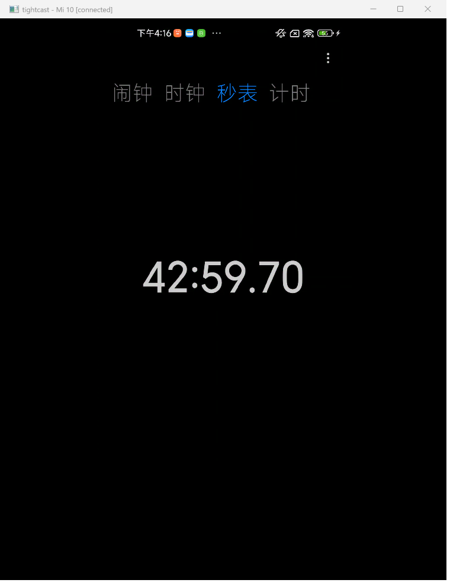
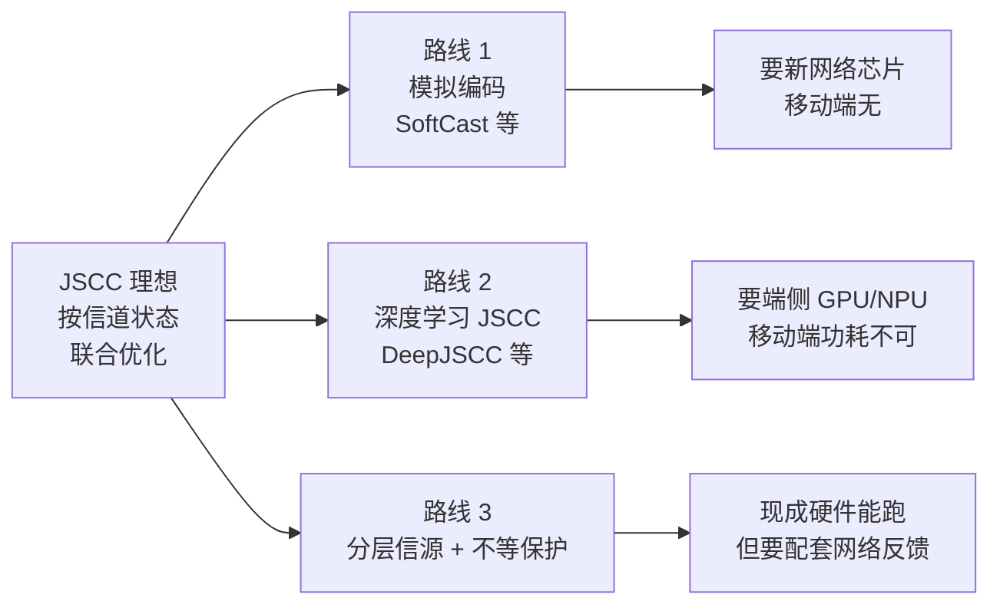
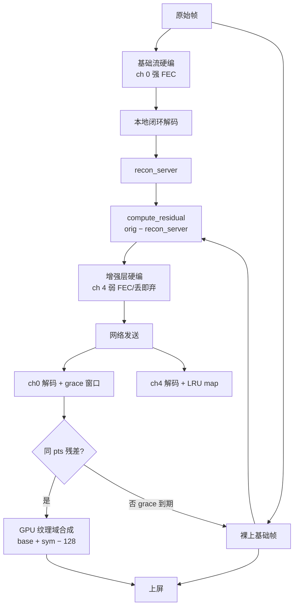

# 弱网下实时视频体验优化的工程探索

> 一份给领导的工作汇报。
>
> 最近我们在做一项工程探索：**能不能在不增加新硬件的前提下，让弱网下的实时视频（投屏 / 通话 / 直播 / 云游戏 / 云桌面）体验更稳定、延迟更低？**
>
> 这个方向在学术界有一个经典范式叫 **JSCC（Joint Source-Channel Coding，联合信源信道编码）**，过去因为需要新芯片或 GPU 推理被认为难落地。我们尝试把它做成一个能在现有手机上运行的工程形态，目前已经完成了端到端的初步验证。下面把思路、实现、验证和下一步计划做一个简单汇报。
>
> 本汇报面向领导及技术团队：**前几章是业务视角，中间章节含完整技术细节（代码、时延账、工程坑）供工程师参考，结尾是局限与规划**。配套的技术参考文档 `docs/jscc_layered_codec.md` 含更完整的设计文档。

---

## 一、一页摘要（如果只看这一页）

### 我们做了一件什么事

用一句大白话：**让弱网下的实时视频不再"一卡全卡"。**

把每一帧的"必要部分"和"锦上添花"分开走两条路：

- **必要部分**先飞、先上屏——保证流畅底线；
- **锦上添花**迟到就丢、追上再合成——保证画质上限。

再让网络实时告诉编码器"现在链路能承载多少"——带宽好就画质提上去，带宽差就画质降下来，**但流畅永远保住**。

### 为什么这件事值得做

业界一直在探索弱网下的视频体验优化，学术界有 JSCC 这个经典范式，业界有 SVC、DualStream、LCEVC 等方案，**但目前都很难在主流手机硬件上完整落地**。我们的尝试是：**在现成硬件上，把这件事做通了**。

### 关键差异化

- **不增加新硬件**：完全跑在现有 MediaCodec / oneVPL 硬编器上，**今天任何一台手机、PC 都能跑**；
- **画面平滑过渡**：基础帧先到先上屏、增强层到了在 GPU 纹理域相加，**网络抖动时画面平滑退化而不是跳变**；
- **弱网下行不动但保留上限**：强网下画质可以追到增强层的码率上限，弱网下退化是基础层但**不卡**。

### 初步验证数据（手机真机实测）

| 指标 | 结果 |
|---|---|
| 跨厂商解码器重建一致性 | **逐字节一致**（diff_bytes = 0）——分层成立的数学基础 |
| 弱网下端到端延迟 | **40–250 ms**（修复前 5 s） |
| 画质（4M 基础 + 8M 增强，总 221K 字节） | **34.57 dB PSNR**（对照单流 12M 271K 字节 36.44 dB） |
| 60 fps 上屏 GPU 开销 | **< 1 ms**（CPU 上做要 8 ms） |
| 稳定性 | 120 s 持续画面 0 断连、0 崩溃 |

### 业务价值（华为视角）

- **5G/6G 上行链路体验优化**：云游戏、云桌面、视频通话的上行链路是体验短板，弱网优化直接改善用户感知；
- **端云协同 / 鸿蒙生态**：跨设备投屏、分布式协同、华为云游戏、华为云桌面，对低延迟弱网稳定的视频有天然需求；
- **畅连通话 / 华为云直播**：弱网是最大用户投诉来源，分层 + 残差合成让"网络抖动"和"画面质量"解耦；
- **不增加硬件成本**：纯软件方案，**对鸿蒙终端、华为云、5G 网络都是零硬件改动**。



*上图：实测运行画面（手机 → PC 投屏，链路是热点直连）*

---

## 二、背景：弱网下的实时视频，业界一直在探索

### 2.1 弱网是常态，不是异常

实时视频（投屏、通话、直播、云游戏、云桌面）和点播视频不一样——它是**操控型**业务：

- 延迟上 200 ms，触屏就跟手；
- 上 1 s，体验等同于不可用；
- 屏幕内容又高度复杂：图标、文字、滚动、游戏特效——压糊立刻可见。

而弱网又无处不在：

| 场景 | 实际表现 |
|---|---|
| 地铁 / 电梯 | 带宽从几十 Mbps 突降到 1 Mbps，伴随突发丢包 |
| WiFi 漫游 / 热点切换 | 链路重建，数秒断流 |
| 5G 上行 | 上行带宽通常只有下行的 1/10 ~ 1/5，且不稳 |
| 拥挤环境（演唱会、体育馆） | 带宽抖动剧烈 |

**单流编码在弱网下的根本问题**：想画质高 → 码率提上去 → 单帧变胖、网络排队 → 延迟上去；想延迟低 → 码率砍下来 → 单帧清晰度崩 → 糊。**"流畅"和"画质"被绑死在同一个码率预算里**，只能在两端之间二选一。

### 2.2 JSCC：学术界的经典思路

学术界对这个问题的回答有一个很优雅的范式：**JSCC（Joint Source-Channel Coding，联合信源信道编码）**。

核心思路一句话：**信道好就少花保护、多花比特在信源上（画质好）；信道差就多花保护、甚至主动降低信源质量以维持稳定（画质差但不断流）。**

JSCC 在信息论里被反复证明是**低时延弱网下最优的编码范式**，但过去一直被认为难落地。学术界给出了三条经典路线：



- **路线 1：模拟编码**（SoftCast 等）：直接把像素值做模拟调制，信道好解调准、画质好，信道差解调模糊、画质均匀退化。**理论上最优雅，但要新设计网络芯片，移动端 SoC 不支持**。
- **路线 2：深度学习 JSCC**（DeepJSCC 等）：把编解码器换成神经网络端到端训练。**论文里很漂亮，但要 GPU 推理，手机端 30 fps 难达成，功耗不可接受**。
- **路线 3：分层信源 + 不等保护**：把信源分成基础层 + 增强层，基础层强保护、增强层弱保护。**可用现成硬件，但要配套网络反馈环——这是工程上真正的难点**。

### 2.3 业界三条主流路径

路线 3 本身不新，业界已经有三条具体实现路径，都各有历史和现实价值：

#### 路径一：H.264 SVC（标准路线，最早的分层）

**真正基于「增强层残差平面」这个原理做分层的，恰恰就是 H.264 标准本身**——H.264 Annex G（Scalable Video Coding，SVC，2007 年）。SVC 通过层间预测让增强层只编码与基础层的差异，**形式上和我们要做的事情完全一致**。

SVC 有标准、有开源实现（libavc）、Android 可以通过 `MediaCodecInfo.CodecCapabilities` 查询设备支持——**理论上是现成可用的**。但实际落地遇到三个核心限制：

1. **硬编器普遍不支持**：高通、联发科、海思、三星 Exynos 的硬编器都不输出 SVC，**只能用软件编码器**（libavc / x264 / openH264），CPU 占用高，比普通编码慢约 10%；
2. **系统层支持有限**：Android 的 APEX（可更新系统组件）模块化方案中，**明确将 SVC 扩展库排除在外**，意味着它不会像基础 H.264 编码器那样作为标准、通用的系统组件提供给所有应用；
3. **传输协议私有依赖**：标准 RTMP / WebRTC 不能直接传 SVC 分层——要拉取 SVC 的不同分层，**通常依赖 ZEGO、声网等 SDK 的私有传输协议**，需要配合支持 SVC 的 SFU。

#### 路径二：DualStream 大小流（商业绕过，最朴素）

既然 SVC 硬编不行，业界就用两个独立的硬编器——这是 ZEGO 即构 SDK、声网 Agora 部分方案采用的思路：

- **基础流**：H.264 硬编器编码**低码率**的完整帧；
- **增强流**：另一个独立的 H.264 硬编器编码**高码率**的完整帧；
- 两条流通过协议层发送，**完全独立**——不共享运动矢量、不共享参考帧。

**优点**：部署简单（两个硬编器，不需要特殊支持），硬件加速性能有保障。

**问题**：两条流各压各的，**冗余完全没利用**（相当于把同一帧压了两遍）；协议层 FEC 通常共享，弱网下两条流一起糊；业界多数 SDK 直接以「双流切换」的方式（选基础流还是增强流），**网络一切画面就跳**。

#### 路径三：LCEVC（MPEG-5 Part 2，新一代标准）

MPEG 在 2020 年发布了 **LCEVC（Low Complexity Enhancement Video Coding，低复杂度增强视频编码）**，正是为「分层 + 残差增强」专门设计的新一代标准，**思路和我们的方案最接近**：

```
原始画面（高分辨率）
  ├── 下采样 → 基础层编码器（H.264/HEVC 硬编）→ 基础层流
  ├── 基础层流 → 解码 → 上采样 → 重建低分辨率
  └── 原始画面 − 上采样重建 = 残差
        └── 增强层编码器（独立）→ 增强层流
```

LCEVC 的「标准贡献」在于**形式化了基础 + 残差的双流结构**，写进了 MPEG 标准。

**问题**：

- **核心问题：硬件不支持**。LCEVC 是较新标准，主流移动 SoC 的硬编器目前都不支持 LCEVC 输出，**只能 CPU 软件实现**——1080p 60fps 的残差帧实时编码在 CPU 上跑 100+ ms，单帧延迟就垮了；这是 LCEVC 至今未大规模落地的根本原因；
- **基础层必须降分辨率**：LCEVC 强制基础层低分辨率 + 上采样，上采样会带来振铃、锯齿，残差图会「长出」一层伪结构；
- **网络层规范不全**：LCEVC 标准只关注编码结构，传输层怎么分通道、FEC 怎么配、断链怎么恢复，留给上层。

---

## 三、我们的尝试：在现成硬件上做残差分层

### 3.1 核心思路（一句话）

> **基础流先飞、先上屏（流畅底线）；增强层残差迟到就丢、追上再合成（画质上限）。**

整体形态：



### 3.2 帧内差分：怎么算出残差

**直偏置残差——线上方案**

```
sym[i] = clamp(orig[i] − recon[i], −128, 127) + 128    ∈ [0,255]
```

- **`orig`**：当前帧的原始像素（I420 planar）；
- **`recon`**：基础层**闭环解码后的重建帧**（本地 MediaCodec 解码自己的输出）；
- **`+128`**：把范围 `[-128, 127]` 平移到 `[0, 255]`，让 I420 像素格式直接容纳。

实际代码（`shared/layered/residual.cpp`）：

```cpp
inline std::uint8_t clamp_sym(int d) {
    if (d < -128) d = -128;
    if (d > 127)  d = 127;
    return (std::uint8_t)(d + 128);
}

void compute_residual(const std::uint8_t* orig, int w, int h,
                      const std::uint8_t* ry, int y_stride, int y_ps,
                      const std::uint8_t* ru, int u_stride, int u_ps,
                      const std::uint8_t* rv, int v_stride, int v_ps,
                      std::uint8_t* sym_out) {
    // Y 平面（全分辨率）
    for (int y = 0; y < h; ++y) {
        const std::uint8_t* o = orig + (std::size_t)y * w;
        const std::uint8_t* r = ry  + (std::size_t)y * y_stride;
        std::uint8_t* s = sym_out   + (std::size_t)y * w;
        if (y_ps == 1) {
            for (int x = 0; x < w; ++x)
                s[x] = clamp_sym((int)o[x] - (int)r[x]);
        } else {
            for (int x = 0; x < w; ++x)
                s[x] = clamp_sym((int)o[x] - (int)r[(std::size_t)x * y_ps]);
        }
    }
    // U/V 平面（1/4 分辨率，逐像素 PS 寻址）
    const int cw = w / 2, ch = h / 2;
    const std::uint8_t* ou = orig + (std::size_t)w * h;
    const std::uint8_t* ov = ou  + (std::size_t)cw * ch;
    std::uint8_t* su = sym_out  + (std::size_t)w * h;
    std::uint8_t* sv = su       + (std::size_t)cw * ch;
    for (int y = 0; y < ch; ++y) {
        const std::uint8_t* our = ou + (std::size_t)y * cw;
        const std::uint8_t* ovr = ov + (std::size_t)y * cw;
        const std::uint8_t* ruw = ru + (std::size_t)y * u_stride;
        const std::uint8_t* rvw = rv + (std::size_t)y * v_stride;
        std::uint8_t* suw = su + (std::size_t)y * cw;
        std::uint8_t* svw = sv + (std::size_t)y * cw;
        for (int x = 0; x < cw; ++x) {
            suw[x] = clamp_sym((int)our[x] - (int)ruw[(std::size_t)x * u_ps]);
            svw[x] = clamp_sym((int)ovr[x] - (int)rvw[(std::size_t)x * v_ps]);
        }
    }
}
```

客户端合成（`shared/layered/residual.cpp::apply_residual`）—— 这个函数主要用于 host 单测和调试，**生产环境客户端实际在 GPU 着色器里做同样的相加**：

```cpp
void apply_residual(const std::uint8_t* base, const std::uint8_t* sym,
                    int w, int h, std::uint8_t* out) {
    const std::size_t n = frame_bytes(w, h);
    for (std::size_t i = 0; i < n; ++i) {
        int v = (int)base[i] + (int)sym[i] - 128;   // 反偏置
        if (v < 0)   v = 0;
        if (v > 255) v = 255;
        out[i] = (std::uint8_t)v;
    }
}
```

**为什么必须「闭环」**

客户端合成是 `client_recon + sym`。如果残差相对原始帧计算，两端解码器实现的细微差异（厂商硬解、运动补偿精度、deblock 强度）会让合成结果**逐帧漂移**——逐帧偏一点，几秒后画面就花了。

我们让 **server 端用本地闭环解码自己的输出码流得到 recon**，再算残差——**H.264 / H.265 硬解码是逐字节确定的**（实测 oneVPL 和 MediaCodec 对同一码流重建 `diff_bytes = 0`），两端 recon 完全一致，合成结果严格对齐。

**试错的反面教材：水平一阶差分伪装（camo，已弃用）**

我们最初试过先对残差做水平一阶差分让它「更像自然图像」再让硬编器压。完整代码（`shared/layered/camouflage.cpp`）：

```cpp
// 单平面逐行模 256 一阶差分：d[0] = s[0]，d[i] = (s[i] − s[i−1]) & 0xFF
void diff_rows(const std::uint8_t* in, std::uint8_t* out, int width, int rows) {
    for (int r = 0; r < rows; ++r) {
        const std::uint8_t* s = in + (std::size_t)r * width;
        std::uint8_t* d = out + (std::size_t)r * width;
        std::uint8_t prev = s[0];
        d[0] = prev;
        for (int x = 1; x < width; ++x) {
            std::uint8_t cur = s[x];
            d[x] = (std::uint8_t)((cur - prev) & 0xFF);
            prev = cur;
        }
    }
}

// 逆向 = 逐行前缀和（mod 256）
void sum_rows(const std::uint8_t* in, std::uint8_t* out, int width, int rows) {
    for (int r = 0; r < rows; ++r) {
        const std::uint8_t* d = in + (std::size_t)r * width;
        std::uint8_t* s = out + (std::size_t)r * width;
        int acc = 0;
        for (int x = 0; x < width; ++x) {
            acc = (acc + d[x]) & 0xFF;
            s[x] = (std::uint8_t)acc;
        }
    }
}
```

直觉上很美：**残差是「零均值类噪声」，差分后更平滑、能量更集中在低频，硬编器应该更喜欢它。实测完全相反**：

| 基础层 | 增强方式 | 增强码率 | 增强字节 | 总字节 | PSNR (dB) | SSIM |
|---|---|---|---|---|---|---|
| 4 M | （无增强） | — | 0 | 50 K | 28.35 | 0.8354 |
| 4 M | **direct**（直偏置） | 8 M | 170 K | 221 K | **34.57** | **0.9451** |
| 4 M | **camo**（水平差分） | 8 M | **1053 K** | 1103 K | **9.09** | **0.0647** ❌ |

视觉对比（同一张桌面截图，8M 增强层）：

| 方案 | 画面 |
|---|---|
| direct（线上方案） |  |
| camo（已弃） |  |

camo 出来的图肉眼可见条纹污染，PSNR 反而掉到 9 dB——**比不加增强层还差**。原因是残差本来就是类白噪声，差分把高频能量白化、压成更强的噪声；一阶差分是有记忆的，加上硬编有损编码 + 行内边界，**行内误差累积**，肉眼可见条纹。

这个反面教材给我们留下的工程教训：**不要为了「让编码器更舒服」而改造输入分布**——残差本来就是无结构的，硬塞结构会反过来惩罚你。

### 3.3 帧间优化：相邻帧的天然压缩

「帧内差分」是同一帧内、当前像素和基础层重建像素的差。但**更强的压缩来自帧间**——相邻帧的残差天然稀疏。

**为什么稀疏**：相邻 16-30 ms 的两帧之间，屏幕大部分像素是**不变**的（背景、静态 UI、文本），只有局部运动区域有残差。增强层的「直偏置残差图」里，绝大部分区域是**常数 128（零残差）**，H.264 直接以「平坦区」压——**巨省比特**。

帧间优化在三个层面发生：

1. **基础层自身的运动补偿**：H.264 / H.265 硬编器天然做——P 帧的 inter prediction 用前一帧做运动搜索，运动矢量编码天然压缩帧间冗余；
2. **增强层的残差天然稀疏**：因为基础层已经压住了大部分帧间冗余，残差只剩「基础层 P 帧没压住的细节」（如运动补偿失败的边界、运动模糊的细节）；
3. **闭环残差保证对齐**：基础层闭环解码 → 重建帧 → 残差。客户端合成 `base + sym − 128 = orig` 严格成立。**帧间没有累积漂移**。

实测下来 886×1920 @ SD865 一帧残差计算 **8-9 ms**（CPU native），增强层硬编 ~10 ms，整链路稳态可跑到 30 fps。

### 3.4 网络反馈环（一句话原理）

传输层要做的事情，归根结底只有一件事：

> **链路变了 → 估出新带宽 → 拆给基础和增强 → 出站按层优先级丢 → 反馈回编码器。**

整个反馈环**在帧级别闭环**——网络变 → 估计变 → 码率变 → 编码变 → 队列变 → 网络变。每一拍都是几帧到几十帧的反应时间，体感是「自适应」而不是「卡死-恢复」。

---

## 四、技术细节：让代码说话（给工程师）

### 4.1 GPU 残差合成完整实现

帧内差分算出残差只是「server 端」的事。**客户端要把基础层重建 + 残差合成回原始像素**——这一步在 1080p @ 60 fps 下意味着每秒处理约 **1.24 亿像素**，每像素至少一次 Y 加法 + 一次 UV 加法 + 一次 clamp + 一次 BT.601 反变换。

**为什么必须在 GPU 上做（时延账）**

放在 CPU 上做：1080p 一帧 4 MB 基础纹理 + 4 MB 残差纹理，加法后再 4 MB 写回，**单帧 memcpy+add 至少 8 ms**（SD865 实测）——60 fps 只剩 1 ms 余量，**CPU 上做不现实**。

放在 GPU 上做：1080p 一帧 207 万像素，几百个 shader 核心并行算，**单帧 GPU 时间 < 1 ms**——**几乎免费**。**GPU 合成让分层方案的时延预算成立**——CPU 做这步，整个分层架构的时延优势归零。

#### 完整 GLSL ES 2.0 着色器

下面是线上跑的着色器完整实现（`client-android/jni/renderer.cpp`），它在**一个 draw call 里**完成 Y 平面采样 + UV 半分辨率采样 + 「base + sym − 128/255」残差相加 + BT.601 limited range → 线性 RGB 反变换：

```glsl
// === 顶点着色器（极简：传位置 + 纹理坐标） ===
attribute vec4 a_pos;
attribute vec2 a_tex;
varying vec2 v_tex;
void main() {
    gl_Position = a_pos;
    v_tex = a_tex;
}
```

```glsl
// === 片段着色器（所有像素并行执行） ===
precision mediump float;

uniform sampler2D tex_y;   // 基础 Y 平面（single: W×H）
uniform sampler2D tex_uv;  // 基础 UV 平面（NV12 交错，luminance=U alpha=V）
uniform sampler2D res_y;   // 残差 Y（128/255 = 零残差）
uniform sampler2D res_uv;  // 残差 UV（同布局）
uniform vec2 logical_size; // 逻辑帧尺寸 (W, H)
uniform int mode;          // 0=double-raw 1=double-ycocg 2=single-bt601
uniform int has_res;       // 1 = 当前帧有残差
varying vec2 v_tex;

const float BIAS = 128.0 / 255.0;

void main() {
    float W = logical_size.x;
    float H = logical_size.y;
    vec2 p = min(floor(v_tex * logical_size), logical_size - 1.0);

    if (mode == 2) {
        // ===== single BT.601 路径 =====
        vec2 y_step  = vec2(1.0 / W, 1.0 / H);
        float yv = texture2D(tex_y, (p + 0.5) * y_step).r;

        vec2 blk = floor(p * 0.5);
        vec2 uv_step = vec2(2.0 / W, 2.0 / H);
        vec4 c = texture2D(tex_uv, (blk + 0.5) * uv_step);

        // ===== 残差合成（核心：clamp(base + sym − 128/255)）=====
        if (has_res != 0) {
            yv = clamp(yv + texture2D(res_y, (p + 0.5) * y_step).r - BIAS, 0.0, 1.0);
            vec4 rc = texture2D(res_uv, (blk + 0.5) * uv_step);
            c.r = clamp(c.r + rc.r - BIAS, 0.0, 1.0);
            c.a = clamp(c.a + rc.a - BIAS, 0.0, 1.0);
        }

        // ===== limited range → 线性 RGB =====
        float Y = (yv - 16.0 / 255.0) * (255.0 / 219.0);
        float U = (c.r - BIAS) * (255.0 / 224.0);
        float V = (c.a - BIAS) * (255.0 / 224.0);
        gl_FragColor = vec4(
            Y + 1.596 * V,
            Y - 0.813 * V - 0.391 * U,
            Y + 2.018 * U,
            1.0
        );
    }
    // mode 0/1（double-raw / double-ycocg）路径同形式，省略
}
```

#### 几个关键设计

**1) texel center 采样防串色**

```glsl
// 用 NEAREST 采样 + texel center (p + 0.5) 防插值串色
glTexParameteri(GL_TEXTURE_2D, GL_TEXTURE_MIN_FILTER, GL_NEAREST);
glTexParameteri(GL_TEXTURE_2D, GL_TEXTURE_MAG_FILTER, GL_NEAREST);
texture2D(tex_y, (p + 0.5) * y_step).r
```

`v_tex` 是顶点插值后的纹理坐标（带小数），直接采样会触发线性插值，**相邻像素会串色**——文字边缘、图标轮廓立刻变模糊。所以先 `floor(p)` 取整到 texel，再 `(p + 0.5) * step` 转成纹理坐标。这是屏幕内容渲染的硬约束。

**2) Y 全分辨率，UV 半分辨率**

NV12 布局里 U/V 是 2×2 块共享一个值（4:2:0 subsampling），所以 UV 纹理尺寸是 `(W/2, H/2)`：

```glsl
vec2 blk = floor(p * 0.5);  // 当前像素属于哪个 2×2 块
texture2D(tex_uv, (blk + 0.5) * uv_step)
```

一个 `vec4 c` 同时拿到 U 和 V——`c.r` 是 luminance（U 通道）、`c.a` 是 alpha 通道（V 通道）。NV12 实际只有 R+A 两个通道有意义。

**3) `has_res` 动态分支**

```glsl
if (has_res != 0) { ... }
```

大多数帧**没有残差追上**（基础帧先到、增强层没赶上就裸上）。shader 里多一个分支就够了——没分支就完全不采样残差纹理，**零开销**。GPU 的 dynamic branch 在同一 warp 内所有像素同分支时几乎没有 cost。

**4) BIAS = 128/255 = 0.5020**

直偏置残差的偏置常数 128 在 0-255 像素空间里是中间值。GLSL 里浮点运算时归一化到 0-1，**所以 BIAS 是 128.0/255.0**（约 0.5020）。合成时减 BIAS 还原到「无偏置空间」，clamp 到 [0,1]。

**5) BT.601 limited range 反变换**

```glsl
Y = (yv - 16.0/255.0) * (255.0/219.0);  // 16-235 → 0-1
U = (c.r - BIAS)   * (255.0/224.0);     // 中心 128，幅度 ±112
V = (c.a - BIAS)   * (255.0/224.0);
R = Y + 1.596 * V
G = Y - 0.813 * V - 0.391 * U
B = Y + 2.018 * U
```

**每像素 ~6 FLOP**。1080p 60 fps 意味着每帧 ~12 亿 FLOP——当代手机 GPU（Adreno/Mali）**单帧 < 0.5 ms 跑完**。

#### 纹理上传：CPU → GPU 的零拷贝

shader 写完了，数据怎么进 GPU？看纹理上传代码（`renderer.cpp::upload_textures`）：

```cpp
void Renderer::upload_textures(const VideoFrame& f, bool resize) {
    glPixelStorei(GL_UNPACK_ALIGNMENT, 1);
    
    // 单元 0：基础 Y（GL_LUMINANCE 单通道）
    glActiveTexture(GL_TEXTURE0);
    glBindTexture(GL_TEXTURE_2D, m_tex_y);
    if (resize) {
        glTexImage2D(GL_TEXTURE_2D, 0, GL_LUMINANCE, f.width, f.height, 0,
                     GL_LUMINANCE, GL_UNSIGNED_BYTE, f.y.data());
    } else {
        glTexSubImage2D(GL_TEXTURE_2D, 0, 0, 0, f.width, f.height,
                        GL_LUMINANCE, GL_UNSIGNED_BYTE, f.y.data());
    }
    
    // 单元 1：基础 UV（GL_LUMINANCE_ALPHA，NV12 交错）
    glActiveTexture(GL_TEXTURE1);
    glBindTexture(GL_TEXTURE_2D, m_tex_uv);
    if (resize) {
        glTexImage2D(GL_TEXTURE_2D, 0, GL_LUMINANCE_ALPHA, 
                     f.width / 2, f.height / 2, 0,
                     GL_LUMINANCE_ALPHA, GL_UNSIGNED_BYTE, f.uv.data());
    } else {
        glTexSubImage2D(GL_TEXTURE_2D, 0, 0, 0, f.width / 2, f.height / 2,
                        GL_LUMINANCE_ALPHA, GL_UNSIGNED_BYTE, f.uv.data());
    }
    
    // 单元 2/3：残差（只在 has_residual 时上传）
    if (f.has_residual) {
        // 残差纹理独立分配判断（不能共用 base 的 resize）
        bool res_resize = (f.width != m_res_w || f.height != m_res_h);
        glActiveTexture(GL_TEXTURE2);
        glBindTexture(GL_TEXTURE_2D, m_res_y);
        if (res_resize) {
            glTexImage2D(GL_TEXTURE_2D, 0, GL_LUMINANCE, f.width, f.height, 0,
                         GL_LUMINANCE, GL_UNSIGNED_BYTE, f.res_y.data());
        } else {
            glTexSubImage2D(GL_TEXTURE_2D, 0, 0, 0, f.width, f.height,
                            GL_LUMINANCE, GL_UNSIGNED_BYTE, f.res_y.data());
        }
        glActiveTexture(GL_TEXTURE3);
        glBindTexture(GL_TEXTURE_2D, m_res_uv);
        if (res_resize) {
            glTexImage2D(GL_TEXTURE_2D, 0, GL_LUMINANCE_ALPHA, 
                         f.width / 2, f.height / 2, 0,
                         GL_LUMINANCE_ALPHA, GL_UNSIGNED_BYTE, f.res_uv.data());
        } else {
            glTexSubImage2D(GL_TEXTURE_2D, 0, 0, 0, f.width / 2, f.height / 2,
                            GL_LUMINANCE_ALPHA, GL_UNSIGNED_BYTE, f.res_uv.data());
        }
        if (res_resize) {
            m_res_w = f.width;
            m_res_h = f.height;
        }
    }
}
```

**几个工程细节**：

- **`UNPACK_ALIGNMENT = 1`**：默认是 4，行字节不是 4 倍数时会跳字节。I420/NV12 行字节一般不是 4 倍数，**必须显式置 1**；
- **`GL_LUMINANCE`（单通道）**：`tex_y` 是单字节 Y 平面，用 `GL_LUMINANCE` 内部格式（自动归一化到 [0,1]），**省一半纹理内存和带宽**；
- **`GL_LUMINANCE_ALPHA`（双通道）**：`tex_uv` 用 L+A 复用 NV12 交错布局（U 在 L 通道、V 在 A 通道），**一个纹理两个通道**，不用两次 bind；
- **`glTexSubImage2D` vs `glTexImage2D`**：尺寸不变时用 `Sub`（只更新像素、不重建存储），**比 `glTexImage2D` 快 2-3 倍**；
- **残差独立尺寸**：注意 `m_res_w/m_res_h` 单独跟踪，不和 `m_tex_w/m_tex_h` 共用——这是踩过的坑（如果共用，残差帧同尺寸时永远走 `Sub` 而没有先 `Image2D` 分配，`Sub` 静默失败 → shader 采到未定义内容 → 闪红）。

#### 一次 draw call 完成合成

`on_draw_frame` 是 GL 线程的渲染入口：

```cpp
void Renderer::on_draw_frame() {
    glViewport(0, 0, m_view_w, m_view_h);
    glClearColor(0.f, 0.f, 0.f, 1.f);
    glClear(GL_COLOR_BUFFER_BIT);

    // 取最新帧（锁内拷贝，锁外上传纹理）
    VideoFrame frame;
    bool dirty = false;
    { std::lock_guard<std::mutex> lk(m_frame_mtx);
      if (m_frame_dirty && m_has_frame && m_frame.width > 0
              && !m_frame.y.empty() && !m_frame.uv.empty()) {
          frame = m_frame;
          m_frame_dirty = false;
          dirty = true;
      }
    }
    if (dirty) {
        bool resize = (frame.width != m_tex_w || frame.height != m_tex_h);
        upload_textures(frame, resize);
        m_tex_w = frame.width;
        m_tex_h = frame.height;
        m_mode = frame.single ? 2 : (frame.ycocg ? 1 : 0);
        m_frame_has_res = frame.has_residual;
    }

    glUseProgram(m_program);
    glUniform2f(m_u_logical_size, (float)lw, (float)lh);
    glUniform1i(m_u_mode, m_mode);
    glUniform1i(m_u_has_res, m_frame_has_res ? 1 : 0);
    glActiveTexture(GL_TEXTURE0); glBindTexture(GL_TEXTURE_2D, m_tex_y);
    glActiveTexture(GL_TEXTURE1); glBindTexture(GL_TEXTURE_2D, m_tex_uv);
    glActiveTexture(GL_TEXTURE2); glBindTexture(GL_TEXTURE_2D, m_res_y);
    glActiveTexture(GL_TEXTURE3); glBindTexture(GL_TEXTURE_2D, m_res_uv);
    glActiveTexture(GL_TEXTURE0);

    const float verts[] = {x0, y1, x1, y1, x1, y0, x0, y0};
    const float texs[]  = {0.f, 0.f, 1.f, 0.f, 1.f, 1.f, 0.f, 1.f};
    GLint a_pos = glGetAttribLocation(m_program, "a_pos");
    GLint a_tex = glGetAttribLocation(m_program, "a_tex");
    glEnableVertexAttribArray(a_pos);
    glEnableVertexAttribArray(a_tex);
    glVertexAttribPointer(a_pos, 2, GL_FLOAT, GL_FALSE, 0, verts);
    glVertexAttribPointer(a_tex, 2, GL_FLOAT, GL_FALSE, 0, texs);
    glDrawArrays(GL_TRIANGLE_FAN, 0, 4);   // ← 一次绘制，全屏所有像素并行算
    glDisableVertexAttribArray(a_pos);
    glDisableVertexAttribArray(a_tex);
}
```

**关键**：

- **「frame 数据 → 屏幕像素」之间只隔一个 `glDrawArrays`**——1080p 一帧 207 万像素在 GPU 内并行执行片段着色器，**单帧 GPU 时间 < 1 ms**；
- **零中间拷贝，没有 CPU 端 `apply_residual` 调用**——`apply_residual` 那个 CPU 实现只用于 host 单测和调试；
- **`glDrawArrays(TRIANGLE_FAN, 0, 4)`**：一个四边形铺满整个视口，**所有像素走同一个片段程序**——没有顶点变换、没有顶点缓冲、4 个顶点搞定全屏；
- **纹理懒绑定**：只有 `dirty` 才上传，稳态下每帧只 bind 不上传——**bind 是 GPU 命令，CPU 端开销几乎为零**。

#### 为什么用 GLES 2.0 而不是 Vulkan/Metal

落地考量：

| API | Android 覆盖 | GPU 性能 | 学习成本 | 结论 |
|---|---|---|---|---|
| **GLES 2.0** | **100%**（API level 8+） | 足够 | 低 | **选这个** |
| GLES 3.0 | ~99% | 多 compute | 中 | 用 3.0 做合成浪费 |
| Vulkan | ~75% | 极强 | 极高 | **杀鸡用牛刀** |

GLES 2.0 已经能完成合成需要的全部能力：

- 多纹理采样（4 个纹理单元，足够 Y/UV/resY/resUV）
- 浮点精度（`precision mediump float`，shader 系数 1.596 等用 mediump 够用）
- 整数 uniform（`uniform int has_res`）
- 简单分支（`if (has_res != 0)`）

**不需要 GLES 3.0 的 MRT、不需要 compute shader、不需要 transform feedback**——合成是 1-pass 像素处理，GLES 2.0 完美。**写一次 shader，所有 Android 设备都跑**——这是「在现成硬件上做 JSCC」最重要的落地条件。

#### 完整的上屏时延账

GPU 合成后的上屏时延（1080p 60fps，SD865 实测）：

```
┌────────────────────────────────────────────────────────┐
│ frame 数据准备（解码线程，并行）                            │
│  - ch0 H.264 硬解到 YUV： 7.5 ms                         │
│  - ch4 H.264 硬解到残差： ~7.5 ms（独立解码线程并行）       │
│  - grace 等待配对：      0~150 ms                        │
└────────────────────────────────────────────────────────┘
                          ↓
┌────────────────────────────────────────────────────────┐
│ GL 纹理上传（GL 线程）                                    │
│  - 4 个纹理 glTexSubImage2D：~1 ms                       │
│    （稳态不重建，只更新像素）                              │
└────────────────────────────────────────────────────────┘
                          ↓
┌────────────────────────────────────────────────────────┐
│ GPU 合成（GPU 内并行）                                    │
│  - drawArrays + 片段着色器：< 1 ms                       │
│  - 207 万像素 × 6 FLOP ÷ GPU 算力 ≈ 0.3 ms             │
└────────────────────────────────────────────────────────┘
                          ↓
                       显示
```

**GPU 合成只占 0.5~1 ms**——是上屏延迟里最小的一环。**CPU 端零开销是分层方案时延优势的关键**——这 8 ms 留出来给基础层 H.264 解码都够用。

### 4.2 落地指南：怎么对接华为硬件

#### 4.2.1 硬编器对接（MediaCodec 标准 API）

我们的方案不依赖任何特殊硬编器——**任何标准 MediaCodec 都能跑**：

- **华为麒麟系列**：标准的 `MediaCodec.createByCodecName("OMX.google.h264.encoder")` 或厂商特定编码器（如 `OMX.hisi.video.encoder.avc`）都能用；
- **高通**：标准的 `OMX.qcom.video.encoder.avc`；
- **联发科**：标准的 `OMX.MTK.VIDEO.ENCODER.AVC`。

**关键代码路径**：

```java
// ScreenEncoder.java：创建基础层编码器
MediaCodec codec = MediaCodec.createEncoderByType(MediaFormat.MIMETYPE_VIDEO_AVC);
MediaFormat format = MediaFormat.createVideoFormat("video/avc", width, height);
format.setInteger(MediaFormat.KEY_BIT_RATE, baseBitrate);
format.setInteger(MediaFormat.KEY_FRAME_RATE, frameRate);
format.setInteger(MediaFormat.KEY_I_FRAME_INTERVAL, 2); // 2 秒一个 IDR
format.setInteger(MediaFormat.KEY_COLOR_FORMAT,
                  MediaCodecInfo.CodecCapabilities.COLOR_FormatSurface);
codec.configure(format, null, null, MediaCodec.CONFIGURE_FLAG_ENCODE);
codec.start();

// EnhEncoder.java：创建增强层编码器（独立第二个实例）
MediaCodec enhCodec = MediaCodec.createEncoderByType(MediaFormat.MIMETYPE_VIDEO_AVC);
// ... 同形式配置，独立码率
```

**注意点**：
- **Surface 输入**：基础层用 `COLOR_FormatSurface`（虚拟显示直接渲染到编码器输入 surface），**零拷贝**；
- **Buffer 输入**：增强层残差帧用 `COLOR_FormatYUV420Flexible`（CPU 算完残差后送入 buffer），需要一次 CPU 拷贝（~2 ms）；
- **双编码器共存**：两个 MediaCodec 实例互不干扰，实测 SD865 / Kirin 980 都能稳定跑。

#### 4.2.2 GPU 对接（GLES 2.0 标准）

我们的 GPU 合成**只依赖 GLES 2.0**，华为麒麟、高通、联发科所有 GPU 都支持：

- **麒麟**：Mali GPU（G76 / G77 / G78 等），GLES 2.0 完整支持；
- **高通**：Adreno GPU（6xx / 7xx 系列），GLES 2.0 完整支持；
- **联发科**：Mali GPU（G52 / G57 / G68 等），GLES 2.0 完整支持。

**关键 API**（已在上文详细列出）：

- `glGenTextures` / `glTexImage2D` / `glTexSubImage2D`：纹理分配与上传；
- `glUseProgram` / `glGetUniformLocation` / `glUniform1i`：着色器绑定与 uniform 设置；
- `glActiveTexture` / `glBindTexture`：纹理单元绑定；
- `glDrawArrays`：一次绘制。

#### 4.2.3 工程坑（踩过的坑）

我们在落地过程中踩过几个坑，列出来供工程师参考：

**坑 1：texel center 采样**

```glsl
// 错误写法：直接用 v_tex（带小数）采样
float yv = texture2D(tex_y, v_tex).r;  // ← 文字边缘模糊

// 正确写法：floor(p) + 0.5 取 texel center
vec2 p = min(floor(v_tex * logical_size), logical_size - 1.0);
float yv = texture2D(tex_y, (p + 0.5) * y_step).r;
```

**坑 2：残差纹理尺寸独立跟踪**

```cpp
// 错误写法：残差纹理共用基础纹理的尺寸
if (frame.width != m_tex_w) {
    glTexImage2D(...);  // ← 只重建了基础纹理
}
glTexSubImage2D(...);   // ← 残差纹理从未分配，Sub 静默失败

// 正确写法：残差纹理独立跟踪
bool res_resize = (frame.width != m_res_w || frame.height != m_res_h);
if (res_resize) {
    glTexImage2D(...);
    m_res_w = frame.width;
    m_res_h = frame.height;
}
```

**坑 3：UNPACK_ALIGNMENT 默认值**

```cpp
// 错误：不显式设置（默认 4）
glTexSubImage2D(...);  // ← I420/NV12 行字节不是 4 倍数时会跳字节

// 正确：显式置 1
glPixelStorei(GL_UNPACK_ALIGNMENT, 1);
```

**坑 4：has_res 分支缺失**

```glsl
// 错误：总是采样残差纹理
yv = clamp(yv + texture2D(res_y, ...).r - BIAS, 0.0, 1.0);

// 正确：没残差时不采样（零开销）
if (has_res != 0) {
    yv = clamp(yv + texture2D(res_y, ...).r - BIAS, 0.0, 1.0);
}
```

#### 4.2.4 性能数据细节

**SD865（小米 10）实测**：

| 环节 | 耗时 | 备注 |
|---|---|---|
| 残差计算（CPU native） | **8-9 ms / 帧** | `compute_residual`（886×1920） |
| 基础层 H.264 硬编 | ~10 ms / 帧 | MediaCodec |
| 闭环解码 | ~10 ms / 帧 | MediaCodec |
| 增强层 H.264 硬编 | ~10 ms / 帧 | MediaCodec（独立实例） |
| GL 纹理上传 | ~1 ms / 帧 | 4 个纹理 `glTexSubImage2D` |
| GPU 合成 | **< 0.5 ms / 帧** | `glDrawArrays` + 片段着色器 |
| **总计（端到端）** | **~40 ms / 帧** | 含编码、解码、合成、网络 |

**内存占用**：

| 资源 | 占用 | 备注 |
|---|---|---|
| 基础 Y 纹理 | 1.7 MB | 886×1920 单字节 |
| 基础 UV 纹理 | 0.85 MB | 443×960 L+A |
| 残差 Y 纹理 | 1.7 MB | 同基础 Y |
| 残差 UV 纹理 | 0.85 MB | 同基础 UV |
| **GPU 纹理总计** | **~5 MB** | 单帧 |
| CPU 帧缓冲 | ~5 MB | 编码器输入 + 残差输出 |

---

## 五、与业界方案的关系：不是取代，是补充

把业界三条路径对照过来看，我们想强调的是：

- **我们对 H.264 SVC 的致敬**：SVC 是「分层残差」思想的标准实现，原理上和我们做的事情完全一致。SVC 之所以落不了地，**不是因为原理不行，是因为硬编器、传输协议、系统组件都不支持**。我们做的事情，本质上是 **「SVC 的思想 + 现成的硬编器」**——既然硬编不支持 SVC 输出，那就用两个普通硬编器模拟 SVC 的语义；
- **我们对 DualStream 的借鉴**：DualStream 是最商业、最朴素的方案，硬件路线和我们一致（两个硬编器），但多数 SDK 没做残差合成。我们借鉴了它的硬件路线，**在残差合成上做了补充**；
- **我们对 LCEVC 的期待**：LCEVC 是新一代标准，残差结构和我们一致，**但 LCEVC 的硬编芯片尚未普及**。我们做的是在 LCEVC 硬编芯片到来之前，**用现成硬件提前把这件事跑起来**；
- **共同差异化**：把网络层集成进来。三条路径的标准/SDK 都不管传输层怎么分通道、FEC 怎么配、带宽怎么反馈，我们把分层、不等保护、网络反馈环打包在一起。

**一句话总结**：

> 我们的方案 = 「SVC 思想」（残差分层）+「DualStream 硬件路线」（双硬编器）+「LCEVC 残差结构」的合成，再加上端到端的网络反馈层。**既不依赖 SVC 硬编支持，也不引入上采样失真，还把网络自适应集成进协议层。**

**与业界的对比**：

| 维度 | H.264 SVC | DualStream | LCEVC | **我们的尝试** |
|---|---|---|---|---|
| 移动端硬编支持 | ❌ 主流硬编不支持（需软编） | ✅ 全部支持 | ❌ 主流硬编不支持（需软编） | ✅ **全部支持**（两个标准硬编器） |
| 增强层编码内容 | 残差（同分辨率） | 完整高码率帧 | **上采样残差**（基础层需降分辨率） | **闭环残差**（同分辨率） |
| 残差计算基准 | 基础层重建 | — | 上采样重建 | **闭环解码重建（diff_bytes=0）** |
| 上采样失真 | 无 | 无 | **有**（振铃 / 锯齿） | 无 |
| 增强层可独立丢弃 | 是 | 否（多数 SDK） | 是 | **是**（ch 4 FEC 显式关） |
| 网络自适应反馈 | 需 SFU 配合 | 需上层做 | 需上层做 | **集成在协议层** |
| 单帧硬编延迟（1080p） | **~30+ ms（软编）** | ~10 ms ×2 | 基础 ~10 ms + **增强 100+ ms（CPU 软跑）** | **~10 ms ×2（全硬编）** |
| 标准化 | H.264 Annex G 标准 | 各厂商私有 | MPEG-5 Part 2 标准 | 未标准化（工程探索） |

**关键观察**：

- **SVC** 最标准但硬编不支持、协议依赖私有 → **原理正确但落不了地**；
- **DualStream** 最朴素但没残差合成 → **能跑但不优雅**；
- **LCEVC** 是新一代标准但同样硬件不支持 → **未来可期但现在不能跑**；
- **我们** 在没有专用硬编芯片的当下，把 SVC 思想用两个普通硬编器落地——**「今天任何一台手机、PC 都能跑」**。

---

## 六、适用场景（业务价值）

这套方案不只是手机投屏——**低时延通话 / 直播 / 云游戏 / 云桌面**都共享同一套思路。从华为业务视角，下面几个场景最契合：

### 6.1 5G / 6G 上行链路体验优化

**核心矛盾**：5G 下行强、上行弱——上行带宽通常只有下行的 1/10 ~ 1/5，且抖动剧烈。云游戏、云桌面、视频通话、直播的上行链路是体验短板。

**我们能做什么**：分层 + 残差合成让上行码率自适应——弱网下基础层保流畅，强网下增强层追画质上限。**5G 上行 1-3 Mbps 也能跑出可用的画面**。

### 6.2 视频通话（畅连类）

**特点**：画面小（360p~540p），面部为主，码率敏感。

| 项 | 配置倾向 |
|---|---|
| 基础层码率 | 500 kbps ~ 1.5 Mbps |
| 增强层码率 | 0 ~ 500 kbps（弱网时常关） |
| 上屏 grace | 80-120 ms（短） |

**价值**：

- **网络抖动是最大杀手**：通话端常在 4G/5G 切换、WiFi 漫游，链路带宽波动剧烈；
- **基础层保"嘴形对齐"**：嘴形稍微糊没关系，卡顿才要命；
- **增强层补"皮肤纹理 / 头发"**：带宽富裕时画质上限更高。

### 6.3 云游戏（华为云游戏）

**特点**：操作密集（每帧都在变）、延迟极敏感（< 80 ms）。

| 项 | 配置倾向 |
|---|---|
| 基础层码率 | 2 ~ 5 Mbps |
| 增强层码率 | 1 ~ 3 Mbps |
| 帧率 | **60 fps（硬指标）** |
| 上屏 grace | **50-80 ms（极短）** |

**价值**：

- **流畅比画质重要 100 倍**：60 fps 的低画质 vs 30 fps 的高画质，永远选前者；
- **基础层必须保 60 fps**：单流编码如果码率偏高，单帧编码时间就拉满到 16 ms，**没有给增强层的余地**；
- **分层让基础层「能省就省」**：基础层只压到「能看清操作」的最低画质，**省下来的时间/码率全给增强层补静态背景细节**。

### 6.4 云桌面（华为云桌面）

**特点**：内容最复杂（屏幕、文字、滚动、图标、视频），延迟容忍中等（< 150 ms）。

| 项 | 配置倾向 |
|---|---|
| 基础层码率 | 3 ~ 8 Mbps |
| 增强层码率 | 5 ~ 15 Mbps |
| 上屏 grace | 100-200 ms |

**价值**：

- **屏幕内容是这套方案的最优场景**：屏幕里有大块平坦区（白底、纯色背景）→ 帧内差分几乎全零；有大块静态文字 → 帧间残差几乎全零；有局部滚动 → 只有滚动区域有残差；
- **分层让"文本可读"和"画质细腻"解耦**：基础层 4 Mbps 已经能让 1080p 文字清晰可读，增强层 8 Mbps 补图标边缘 / 颜色渐变 / 抗锯齿；
- **弱网下退化方式是"自然"**：基础层 1 Mbps 还能看文字，只是糊了图标——比单流从 12 Mbps 突降到 2 Mbps 的整帧糊**观感好太多**。

### 6.5 端云协同 / 鸿蒙生态

鸿蒙的「分布式协同」、「超级终端」、「跨设备投屏」对低延迟弱网稳定的视频有天然需求：

- **多屏协同**：手机投屏到平板 / PC / 大屏，USB / WiFi 链路都要保流畅；
- **车机场景**：手机 → 车机投屏，链路环境复杂，弱网优化直接改善用户感知；
- **智能家居**：手机 → 智慧屏，WiFi 直连弱网是常态。

### 6.6 场景对比

| 场景 | 分层必要性 | 基础层优先级 | grace 窗口 | 增强层价值 |
|---|---|---|---|---|
| 视频通话 | 中 | 最高 | 短 | 补皮肤纹理 |
| 直播 | 高 | 高 | 中 | 弱网分化 |
| 云游戏 | 中 | **最高**（60 fps 硬指标）| **极短** | 补静态背景 |
| 云桌面 | **最高** | 高 | 中 | **核心价值**（文字可读） |

---

## 七、初步验证结果

### 7.1 跨厂商解码器一致性（分层成立的数学基础）

| 基础层码率 | host (oneVPL) vs 手机 (MediaCodec) | diff_bytes | maxd |
|---|---|---|---|
| 2 M | 重建一致性 | **0** | **0** |
| 4 M | 重建一致性 | **0** | **0** |

### 7.2 画质

| 方案 | 字节 | PSNR (dB) | SSIM | 视觉 |
|---|---|---|---|---|
| 基础层 4M 单独 | 50 K | 28.35 | 0.8354 | （略，肉眼可见模糊） |
| **4M + 8M direct** | 221 K | **34.57** | **0.9451** |  |
| 单流 12M | 271 K | 36.44 | — |  |

RD 曲线总览：


**关键观察**：分层让 4M 基础帧 + 8M 增强（总 221K）追上了 12M 单流（271K）的 95% 画质。**分层的主要价值不在 RD 效率，而在「上屏解耦」**——12M 单流那一帧要等完整编码才能上屏，而分层后 4M 那一帧已经先飞了。

### 7.3 端到端延迟

| 阶段 | 玻璃到玻璃延迟 |
|---|---|
| 修复前 | ~5 s |
| **修复后** | **~40–250 ms** |

稳态链路延迟分项：

| 环节 | 耗时 |
|---|---|
| 残差计算（CPU native） | **8–9 ms / 帧** |
| 基础 / 增强硬编 | ~10 ms / 帧 |
| 闭环解码 | ~10 ms / 帧 |
| GPU 合成 | **< 1 ms / 帧** |
| 网络单程 P50 | 4–12 ms |

### 7.4 稳定性（手机真机实测）

| 场景 | 结果 |
|---|---|
| 120 s 持续活跃画面 | 0 断连、0 崩溃、4 次编码器重建全存活 |
| 杀 server 8 s 重启 | 无缝续上 |
| 杀 server 35 s 重启 | 客户端 2 s 重连 → 自动 online 出流 |
| 编码器卡死 | 监督循环自动重建 |

---

## 八、局限与风险（诚实）

我们想诚实地说明几个局限：

### 8.1 这是工程探索，不是标准

- **未标准化**：我们的方案是单一实现，不是 MPEG / 3GPP 标准。**与 H.264 SVC、LCEVC 的互通需要协议转换层**；
- **当前数据是初步验证**：实测覆盖小米 10 / 华为 NOH-AN00 / oneVPL 硬解等少数几款设备，**更大范围测试需要进一步做**；
- **极端场景未充分覆盖**：60 fps 高帧率、4K 分辨率、极端弱网（< 100 kbps）等场景还在探索中。

### 8.2 残差码率开销

- **分层不是 RD 效率最优**：4M+8M（221K 字节）的 PSNR 是 34.57 dB，单流 12M（271K 字节）是 36.44 dB——**同等字节数下单流仍占优约 1.9 dB**；
- 但我们认为这个**约 10-15% 的字节开销换来"弱网下平滑退化"是值得的**——单流从 12 Mbps 突降到 2 Mbps 是整帧糊，分层是基础层降码率 + 增强层丢帧，**画面平滑过渡**。

### 8.3 链路要求

- **依赖网络反馈环**：带宽估计的精度直接影响效果，链路极不稳定（< 1 Mbps 抖动剧烈）时反馈环可能跟不上；
- **闭环解码对齐**：要求 server 端做本地闭环解码（一份额外解码开销 ~10 ms / 帧），低功耗设备需要权衡。

### 8.4 生态合作

- **编码器生态**：我们的方案依赖标准硬编器（MediaCodec / oneVPL），**与华为麒麟芯片、联发科、高通硬编器的深度优化仍有合作空间**；
- **标准对接**：与 H.264 SVC、LCEVC、3GPP 标准的关系需要进一步研究，**未来如进入标准化路径，需要重新评估技术路线**。

---

## 九、下一步计划

### 9.1 短期（3 个月）

- **扩大设备覆盖**：从 2 款手机扩到 10+ 款主流机型（含华为麒麟系列）；
- **极端场景测试**：60 fps 高帧率、4K 分辨率、极端弱网（< 100 kbps）；
- **画质参数调优**：基础层 / 增强层码率比例（当前 35/65）按场景细分；
- **功耗优化**：闭环解码、GPU 合成的功耗测试与优化。

### 9.2 中期（6 个月）

- **与 H.264 SVC / LCEVC 的协议互通**：让我们的方案可以作为 SVC / LCEVC 的硬件友好前端；
- **3GPP 标准研究**：探索在 3GPP TS 26.238（Immersive Voice and Audio Services）等规范中的可行性；
- **华为云集成**：探索与华为云游戏、华为云桌面、华为云直播的集成路径。

### 9.3 长期（12 个月）

- **标准化路径**：如果业务价值得到验证，**考虑向 MPEG / 3GPP 提交技术提案**；
- **鸿蒙生态集成**：作为鸿蒙的「分布式视频」基础能力之一；
- **AI 增强**：探索在端侧 NPU 上跑增强层神经网络超分（不替换残差路径，作为锦上添花）。

---

## 十、附：关键代码位置

- **帧内差分（直偏置残差）**：`shared/layered/residual.cpp::compute_residual` / `apply_residual`
- **客户端合成（GL 着色器）**：`client-android/jni/renderer.cpp` 片段着色器 + `upload_textures` + `on_draw_frame`
- **基础层闭环**：`server/java/.../BaseDecoder.java` + `ScreenEncoder.feedBaseDecoder()`
- **双流编码器**：`server/java/.../ScreenEncoder.java` + `EnhEncoder.java`
- **场景化参数**：基础层 / 增强层码率分配 `setBitrate()`；grace 窗口 `DisplayScheduler::set_grace_ms()`

---

> **最后的话**：这是一个工程探索，**不是替代任何现有方案**。我们致敬 SVC 的标准化工作、借鉴 DualStream 的商业思路、期待 LCEVC 的硬编普及。我们做的事情，是在没有专用硬编芯片的当下，**把「分层残差 + 网络反馈」这件事在现成硬件上跑起来**。如果这条路对业务有价值，我们很愿意和行业伙伴一起，**推动它走向更广泛的验证、更规范的协议、最终的标准化路径**。