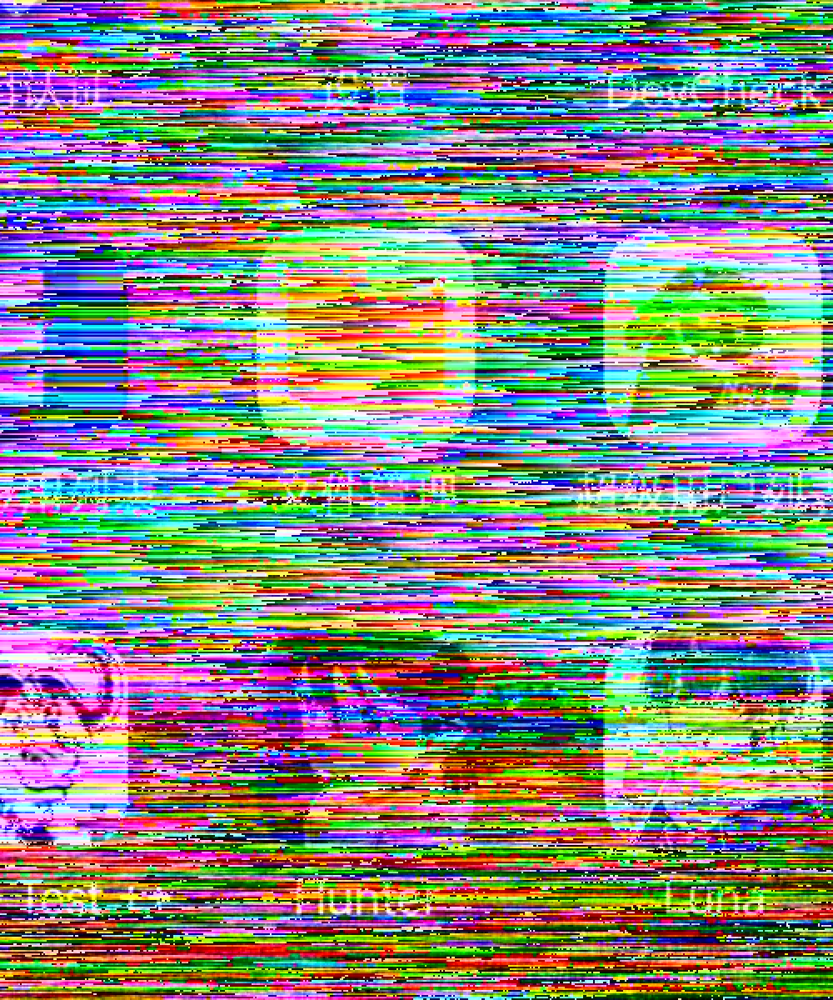

# 分层增强层实验报告（方案A：残差硬件编码可行性）

> 实验代码：`PsnrTest --layer-test`（手机端编码）+ `tools/psnr/layer_finish.py`（host 分析）。
> 产物：`tools/psnr/out/layer/`（不入库可复现）。
> 结论先行：**差分伪装（方案A 原设计）不可行；残差直偏置（+128）直接硬编可行，
> 线上 layer 模式采用后者**（差分模块 camouflage.cpp 保留作负面对照）。

## 1. 实验设置

| 项 | 值 |
|---|---|
| 手机 | 小米 10（SD865），MediaCodec 硬编/硬解 |
| host | Core Ultra 5 125H + Arc，oneVPL 硬解 |
| 基准帧 | ref.rgba 886×1920（同 [test_report.md](test_report.md) 新桌面） |
| 流程 | 基准帧 → single I420 → 基础层 H.264（2M/4M）→ 本地闭环解码得重建帧 → 残差 sym = clamp(orig−recon,−128,127)+128 → 两路增强编码对比：**direct**（sym 直接当 I420 帧）vs **camo**（方案A：逐行模 256 一阶差分伪装）各 5 档（0.5M/1M/2M/4M/8M CBR） |
| 对照 | Rice 无损熵编码残差（shared/layered/entropy.cpp） |

## 2. 跨解码器确定性校验（闭环设计前提）✅

oneVPL（host）解码基础层码流 vs MediaCodec（手机）本地解码重建，逐字节比对：

| 基础层 | diff_bytes | maxd |
|---|---|---|
| 2M | **0 / 2551680** | 0 |
| 4M | **0 / 2551680** | 0 |

异厂商解码器（Intel oneVPL vs 高通 MediaCodec）对同一 H.264 码流重建**逐字节一致**——
server 端"编码→本地解码→求残差"的闭环残差与 client 端重建严格对齐，合成无损性成立。

## 3. 分层合成质量（PSNR/SSIM vs ref）

| 基础层 | 增强 | 增强码率 | 增强字节 | 总字节 | PSNR(dB) | SSIM |
|---|---|---|---|---|---|---|
| 2M | （无增强） | - | 0 | 44K | 27.19 | 0.8400 |
| 2M | direct | 500k/1M/2M | 35K | 80K | 28.72 | 0.8514 |
| 2M | direct | 4M | 42K | 86K | 29.52 | 0.8646 |
| 2M | direct | 8M | 168K | 213K | **34.36** | 0.9433 |
| 2M | camo | 500k/1M/2M | 423K | 467K | 9.36 | 0.0440 |
| 2M | camo | 4M | 830K | 874K | 9.00 | 0.0519 |
| 2M | camo | 8M | 1254K | 1298K | 9.23 | 0.0714 |
| 4M | （无增强） | - | 0 | 50K | 28.35 | 0.8354 |
| 4M | direct | 500k/1M/2M | 34K | 85K | 29.60 | 0.8653 |
| 4M | direct | 4M | 39K | 90K | 29.92 | 0.8716 |
| 4M | direct | 8M | 170K | 221K | **34.57** | 0.9451 |
| 4M | camo | 500k/1M/2M | 425K | 476K | 9.41 | 0.0499 |
| 4M | camo | 4M | 841K | 892K | 9.00 | 0.0574 |
| 4M | camo | 8M | 1053K | 1103K | 9.09 | 0.0647 |

（无增强列的 SSIM 为 base-only；direct 500k/1M/2M 三档字节相同 = 编码器 QP 钳制，
同内容同输出，同 [test_report.md](test_report.md) §3.4 台阶现象。）


基础层 4M 单发（28.35dB，文字区域放大）


direct 增强 4M+2M（总 85K，29.60dB）：文字边缘明显收敛


direct 增强 4M+8M（总 221K，34.57dB）：接近原图


camo 增强 4M+8M（总 1103K，9.09dB）：行向条纹污染——误差沿前缀和累积的直接证据

## 4. 核心结论

### 4.1 差分伪装（方案A 原设计）不可行 ❌

两个叠加原因：

1. **残差是类白噪声，差分放大高频能量**。H.264 量化噪声逐像素弱相关，
   d[i]=s[i]−s[i−1] 使噪声方差翻倍且白化，编码器面对"满幅高频噪声"只能堆比特：
   同档体积是直偏置的 **6~21 倍**（500k 档 423K vs 35K）。
2. **有损编码 + 前缀和 = 行内误差累积**。差分域任意像素被量化改动，逆变换
   前缀和把它传播到该行右侧全部像素（条纹污染，SSIM 崩到 0.05）。

### 4.2 直偏置残差直接硬编可行 ✅（线上采用）

- **体积**：85K~221K 总字节即可把 28.35dB 基础层提到 29.60~34.57dB；
  比 Rice 无损熵编码（1388K）小 **6~16 倍**（Rice 无损但体积不可接受）。
- **RD 对比 single 直编**：layered 4M+8M（221K→34.57dB）vs single@12M
  （271K→36.44dB，[test_report.md](test_report.md) §3.2）——单层高码率仍占优；
  分层的价值不在 RD 效率，而在**上屏解耦**（基础帧低时延先上屏、增强帧赶上再合成）。
- **机理**：零残差区 sym=128 平坦、噪声幅值小，编码器低码率即收敛；
  增强码流本质是一张"近灰噪声图"，恰在 H.264 舒适区。

### 4.3 耗时（SD865，886×1920/帧，实测）

| 环节 | 实测 | 说明 |
|---|---|---|
| 残差计算（native） | 8~9ms | compute_residual |
| 迷彩差分（native） | 3~5ms | （已弃用，仅对照） |
| 基础层编码 | 70~104ms | **冷启动含 codec 创建/销毁**，稳态管线 ~10ms 级 |
| 闭环解码一帧 | 115~123ms | 同上，稳态解码 ~10ms 级 |
| 增强层编码 | 69~142ms | 同上 |
| Rice 熵编码（对照） | 88~93ms | 含残差计算 |

实验里每个码流都新建/销毁 codec（70~142ms 主要是启动开销）；线上管线 codec
常驻，逐帧耗时与现有编码路径同级（~10ms 级），满足 30fps 增强层吞吐。
增强层相对基础帧的固有滞后 = 基础解码 + 残差 + 增强编码 ≈ 20~30ms（稳态），
与"赶不上就上屏低码率帧"的语义匹配。

## 5. 复现

```bash
# 手机端（root 小米，adb 连 PC）
./server/build.sh
adb -s <serial> push server/out/server.jar server/out/jni/libtight_jni.so /data/local/tmp/tightcast/
adb -s <serial> push tools/psnr/out/ref.rgba /data/local/tmp/tightcast/
adb -s <serial> shell "su -c 'CLASSPATH=/data/local/tmp/tightcast/server.jar \
    app_process /system/bin com.tightcast.server.Server --layer-test \
    /data/local/tmp/tightcast/ref.rgba /data/local/tmp/tightcast/layertest'"
adb -s <serial> pull /data/local/tmp/tightcast/layertest/. tools/psnr/out/layer/

# host 端
python tools/psnr/layer_finish.py   # → tools/psnr/out/layer_results.md + cmp_*.png
```
