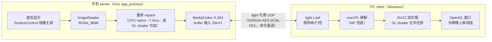
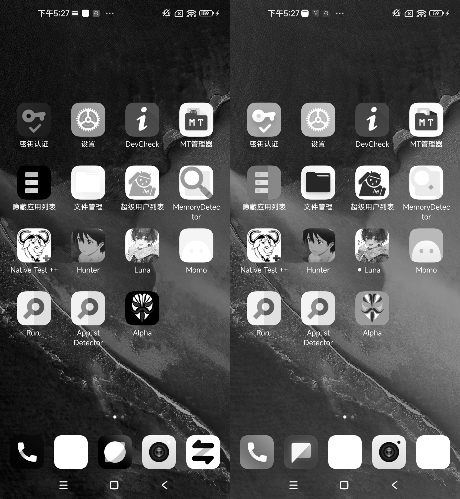
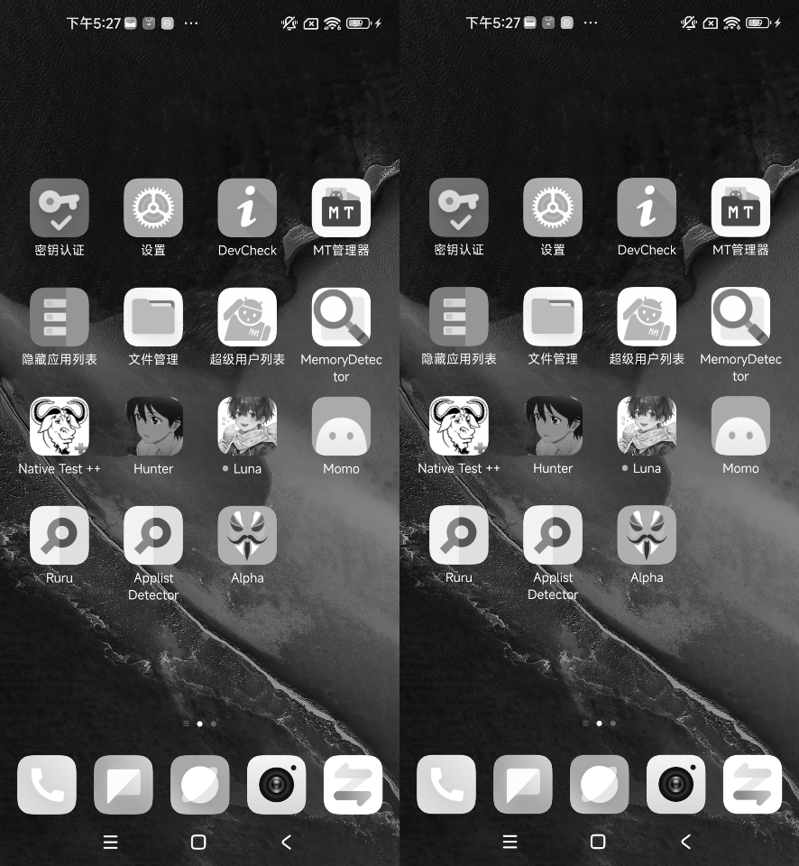
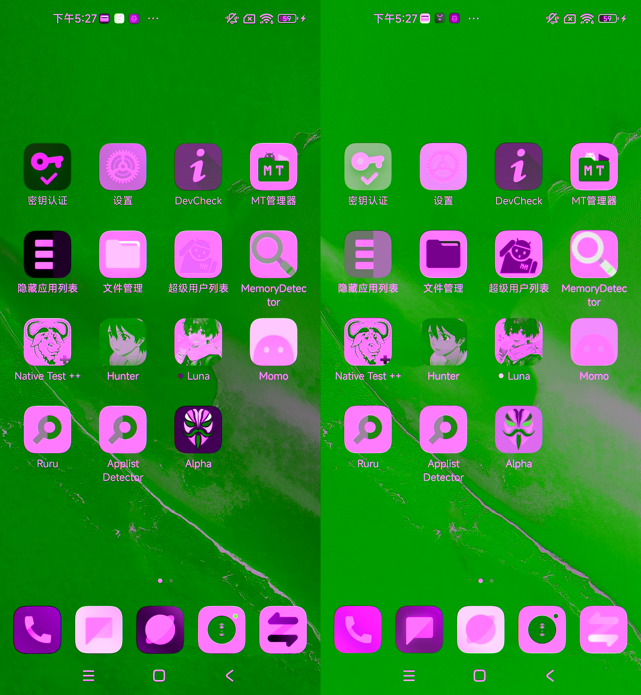

# YCoCg 双 YUV420 打包管线设计

> tightcast 视频链路的核心：让 4:2:0 硬编 H.264 承载 RGB 4:4:4 画面，
> 文字/彩边零亚采样损失，且利用通道相关性把码率-失真效率做到最优。
> 线上格式契约见 [protocol.md](protocol.md) §3；本文是设计文档。

## 1. 问题背景

手机画面是 RGB888（3 字节/像素），而硬件 H.264 编码器只接受 4:2:0
（1.5 字节/像素）：色度横竖各减半，文字边缘、彩色图标的色度被糊掉
（发虚、渗色）。直接 4:2:0 编码的观感损失集中在彩色细节上。

## 2. 总体架构



**关键数字**：双 YUV420 两帧合计 3 字节/像素 = RGB888 字节数，信息量无损
承载；打包/还原是**纯字节重排**（或 ±1~2 舍入的整数变换），无 DSP 有损环节。

## 3. 打包格式 v1：RGB 原样搬运（protocol §3.1）

每个 RGB 帧拆成左右拼接的两个"YUV420 帧"（2W×H 一帧进编码器）：

```
Y 平面 2W×H：   [ R(x,y) 全分辨率 | B(x,y) 全分辨率 ]
U 平面 W×H/2：  [ G 块内左上 | G 块内左下 ]   ← 按 2×2 块奇偶
V 平面 W×H/2：  [ G 块内右上 | G 块内右下 ]
```

### 3.1 打包帧实拍（桌面真屏打包后的各平面）

**Y 平面**（左半 R、右半 B——中间一条垂直接缝是唯一硬边，编码器友好）：



**U 平面**（按 2×2 奇偶装全分辨率 G；每平面内部是 2× 亚采样的平滑图像，
无棋盘格/高频突变——拆到 4 个平面正是为了保证单平面内空间平滑）：



**整帧按 YUV 渲染的伪彩图**（直观感受排布；绿/品红是 R/B 字节被当
亮度/色度解释的正常现象）：



## 4. 打包格式 v2：YCoCg 色差打包（protocol §3.2，默认）

v1 原样搬运没利用通道相关性：UI 画面大面积近灰（白字深色底），
R≈G≈B，三个通道存了三份近似冗余。v2 先做整数 YCoCg 变换再按**完全相同
的布局**打包：

```
Y' = (R + 2G + B + 2) >> 2        // 真亮度  → Y_A（全分辨率）
Co = ((R - B) >> 1) + 128         // 橙差    → Y_B（全分辨率）
Cg = ((2G - R - B) >> 2) + 128    // 绿差    → 色度平面（按 2×2 奇偶，全分辨率）
```

还原（client shader）：

```
cg = Cg - 128;  co = Co - 128
G = Y' + cg;  B = Y' - cg - co;  R = Y' - cg + co     // ±1~2 舍入
```

**收益机理**：近灰区域 Co/Cg ≈ 128 常数、幅度小，色度几乎不耗比特；
Y 平面承载的是真亮度——H.264 帧内/帧间预测最擅长的形态。实测同画质
所需字节约为 v1 的 **1/3**（见[测试报告](test_report.md)）。

**局限**（实测发现）：鲜艳高饱和内容（彩色壁纸/视频）里 Co/Cg 不再
平坦，收益收窄——近灰 UI 画面收益最大。协议保留 `--yuv-raw` 回退 v1。

## 5. 线上格式

视频消息头（protocol §3）：`[tag=0x56][flags][pts_ms u64be][Annex-B AU]`

- flags bit0 = IDR 关键帧
- flags bit1 = YCoCg 打包（v2）；0 = v1 RGB 原样
- **逐帧自描述**，两种模式可混流切换（client shader 按位选公式）
- IDR 前必拼 SPS/PPS（Annex-B）

## 6. server 端实现要点（`server/`）

- **采集**：`SurfaceControl.createDisplay`（反射隐藏 API，root）虚拟显示
  镜像主屏 layerStack → `ImageReader(RGBA_8888)`；静态画面不产生新帧
  （SurfaceFlinger 只在内容变化时合成），天然按需编码。
- **重排**：默认 CPU native（`repack_core.cpp`，实测 SD865 ~7.5ms/帧）；
  `--gl-repack` 可选 GPU gather shader（SurfaceTexture 零拷贝，但
  GPU→CPU 回读 ~10ms/帧，本机更慢，默认关）。
- **编码**：MediaCodec `video/avc` buffer 输入（YUV420Flexible，
  `getInputImage()` 按 plane stride 填充），异步回调模式 +
  在途帧 ≤1（防编码器内部排队积压）；`latency=0`、`priority=0`。
- **码率**：`--bitrate` 是硬上限（只降不超）；tight `video_capacity_bps`
  回调驱动下调（>15% 才下发）。
- **IDR 保障**：关键帧请求 → 先试 `PARAMETER_KEY_REQUEST_SYNC_FRAME`，
  >2.5s 未出 IDR（MIUI 常忽略同步帧请求）则整体重建编码器+采集链
  （新编码器首帧必为 IDR）；旋转/尺寸变化轮询重建；编码器卡死自愈
  （有喂入但 >2s 无输出 → 重建）。
- **出站积压丢帧**：tight 贷款（5s）允许的排队是端到端延迟大头——
  发送前查出站队列，积压超 ~100ms 等值时 P 帧不进队（对端缺帧 →
  客户端请求关键帧快速恢复）。

## 7. client 端实现要点（`client/`）

- **解码**：oneVPL 硬解（`MFX_IMPL_TYPE_HARDWARE` 会话，显存 surface
  Map 回读 NV12），MF+D3D11 兜底；零缓冲（收到即解）。
- **渲染**：NV12 拆 Y（GL_LUMINANCE）/UV（GL_LUMINANCE_ALPHA）双纹理，
  fragment shader 按 §3.1/§3.2 公式逐像素还原（NEAREST + texel center
  采样，防插值串色）；无 CPU 色彩转换。
- **不乱序不断链**（花屏防线，三条）：
  1. 视频通道**不开 ARQ**（重传乱序送达会断 H.264 解码顺序）——
     纯 FEC + 丢帧即请求关键帧；
  2. 单槽队列**顶帧拒收**：槽里有未解码帧时新 P 帧直接拒收
     （保留旧帧正常解码），不顶掉未解码 P 帧；
  3. **pts 顺序闸**：pts 不增的旧帧按丢帧处理。
- **上屏调度**（令牌桶）：每 1/display-fps 发 1 令牌，有令牌立即上屏；
  无令牌按 `--max-queue n` 冗余排队；**队满丢最旧留最新**（画面静止后
  不再来新帧，丢最新帧端侧会永远停在旧状态）；卡顿期令牌积攒可补屏。

## 8. 工程坑清单（血泪实录）

| 坑 | 解法 |
|---|---|
| tight 载荷首字节 0x01/0x02/0x03 被库内部 file/data 路由占用 | 视频/音频消息加 tag 前缀（0x56/0xA1） |
| MIUI 编码器不打 KEY_FRAME 标志、常忽略同步帧请求 | 码流扫 NAL type=5 兜底 + 超时整体重建 |
| MF 解码器 AVC1 子类型期望 AVCC 码流 | Annex-B 输入必须用 MFVideoFormat_H264 |
| oneVPL 输出是显存 surface（Pitch=0） | FrameInterface->Map(MFX_MAP_READ) 回读 |
| ImageReader close 与 native 重排竞争 → SIGSEGV | captureLock 互斥 + 尺寸/容量防御 |
| JNI 持锁调 tight × tight 线程回调 Java → ABBA 死锁 | JNI 一律先取快照再调 tight（锁序统一） |
| tight 库内每包 printf 拖垮收发线程 | 全部宏化到 TIGHT_DBG_PACKET_LOG（默认关） |
| 企业 WiFi 阻断客户端间 UDP | USB RNDIS 点对点 + Android 策略路由补表 |

## 9. 性能实测（小米10 SD865 ↔ Core Ultra 5 125H/Arc，USB RNDIS ~250Mbps）

| 指标 | 实测 |
|---|---|
| 端到端延迟（秒表法） | **~40-250ms** |
| 网络单程 P50 | 4-12ms |
| server 重排 | CPU ~7.5ms/帧（GL ~10ms） |
| client 解码 | oneVPL 硬解 ~7.5-8.5ms/帧（含 GPU→CPU 回读） |
| 采集→编码完成 | 见 server 日志 `capture→encoded avg`（~10ms 级） |
| 帧率 | 内容驱动，活跃画面 30-60fps，in≈out 零丢弃 |
| 画质 | 见[测试报告](test_report.md) PSNR 对比 |


## 10. 复现与工具

- 画质测量：`tools/psnr/`（手机 `PsnrTest` 出流 + host `vpl_decode` +
  `psnr_finish.py` Pillow 算 PSNR），方法详见[测试报告](test_report.md)。
- 打包正确性单测：`server/jni/repack_test.cpp`（`g++ -O2 -std=c++17
  server/jni/repack_core.cpp server/jni/repack_test.cpp` → ALL TESTS PASSED）。
