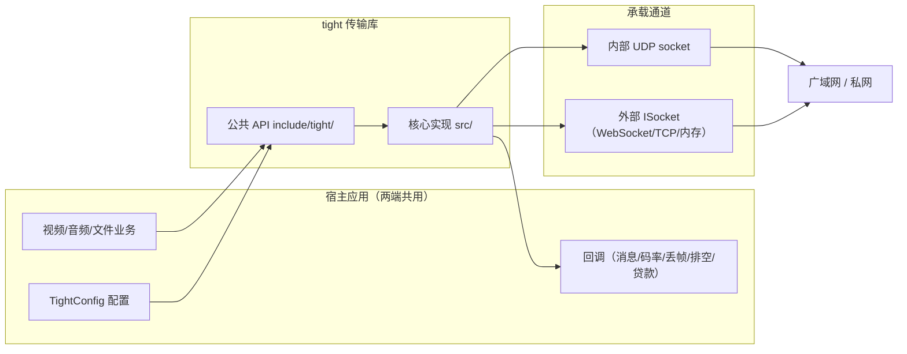
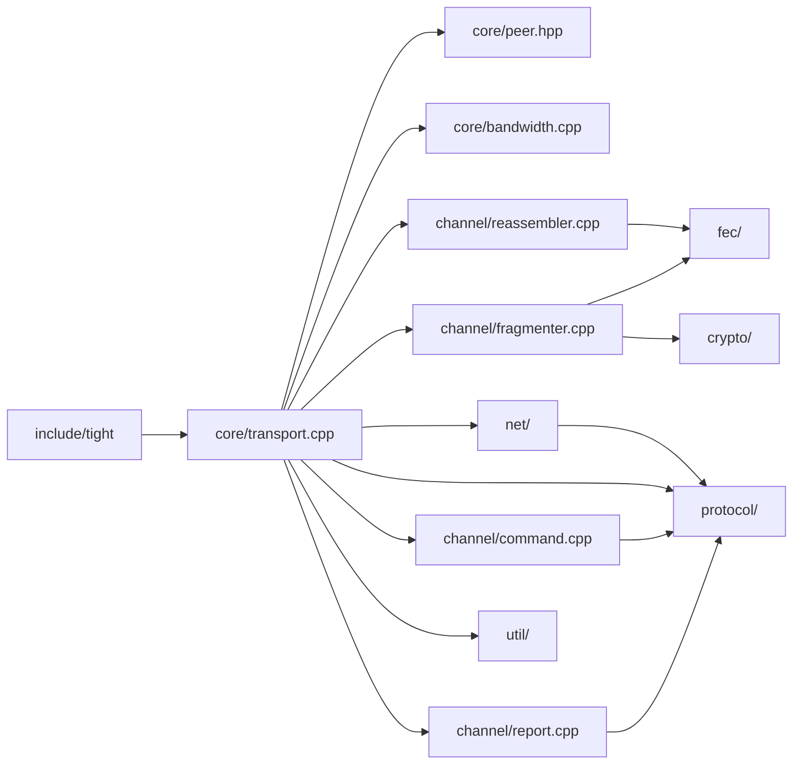
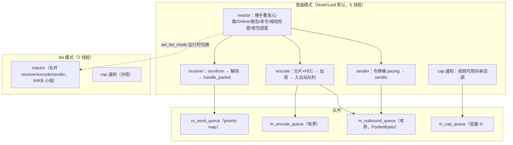
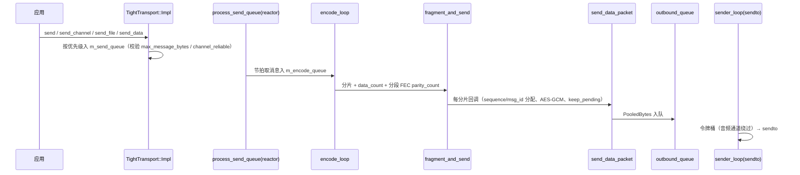
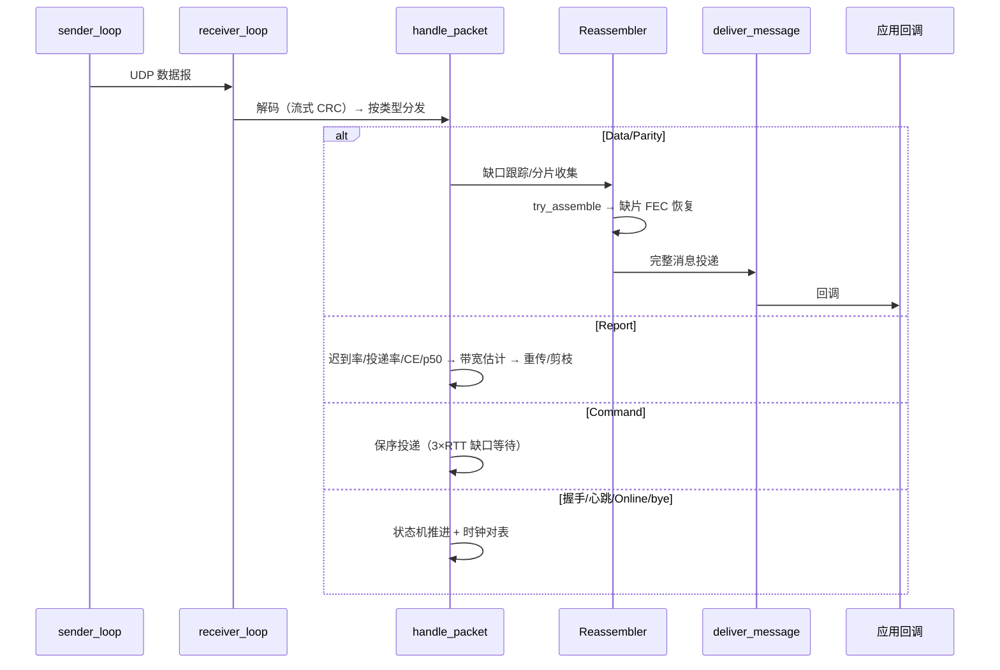
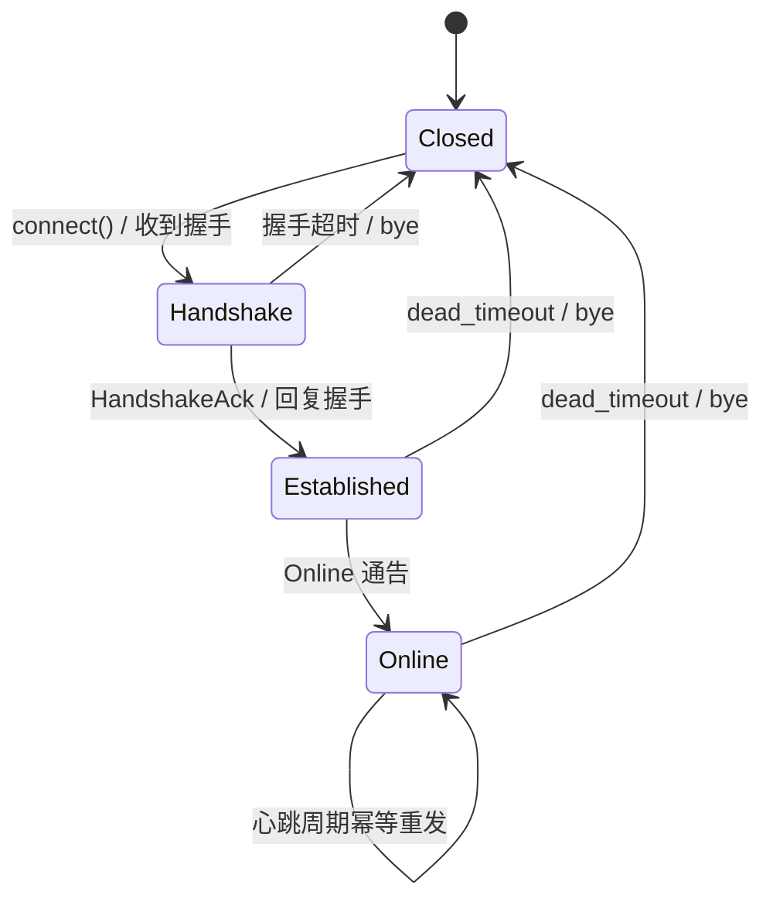
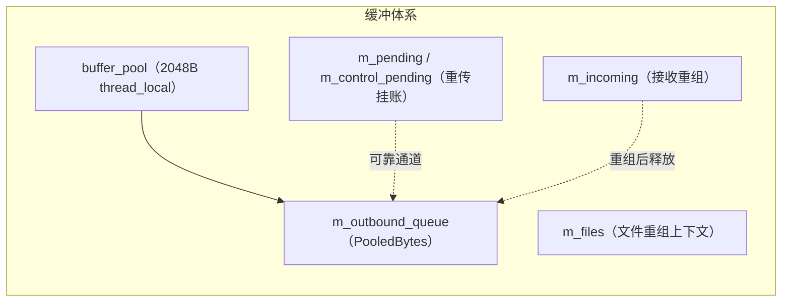
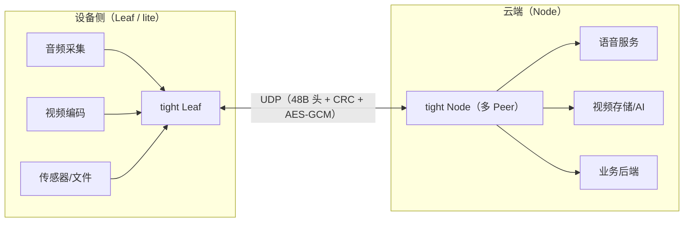

# tight — 架构设计文档

> 文档类型：架构设计说明书（ADD）
> 适用范围：tight 可靠 UDP 传输协议库 v0.x
> 相关文档：[需求描述](requirements.md) · [详细设计](tight_design.md) · [使用文档](usage.md) · [API 参考](api_reference.md)
> 说明：本文为系统级架构视图（分层/模块/线程/数据流/状态机/部署/扩展点）；逐模块实现细节见 `tight_design.md`。

## 1. 设计目标与架构原则

| 原则 | 说明 | 对应需求 |
|---|---|---|
| P-1 单一代码双角色 | 同一份 `TightTransport` 以 Node/Leaf 角色运行，lite 模式运行时切换 | G1, FR-01 |
| P-2 分层解耦 | 应用层 / 公共 API / 核心实现 / 基础设施 / 系统层严格分层 | G5 |
| P-3 单生产者多消费者 | 出站队列：reactor/encode 只入队，sender 只出队，socket 阻塞不拖累协议核心 | NFR-08 |
| P-4 接收不被发送阻塞 | 独立 receiver 线程独占 `recvfrom` | NFR-03 |
| P-5 实时音频豁免 | 音频通道独立队列绕过令牌桶，实时性优先 | FR-31 |
| P-6 嵌入式可裁剪 | lite 画像收紧队列/线程/内存；FEC 可全局关闭 | G2, FR-50~52 |
| P-7 可插拔承载 | `ISocket` 抽象允许 UDP/WebSocket/TCP/内存任意通道 | FR-54 |
| P-8 零第三方依赖 | 加密/FEC/测试框架均为内置纯 C++ 实现 | G5, C-05 |

## 2. 系统上下文

## 3. 分层架构

```mermaid
flowchart TB
    subgraph L0["应用层"]
        A1["视频编码器 / 播放器"]
        A2["文件 / 遥测业务"]
        A3["宿主工程（网关/设备固件）"]
    end
    subgraph L1["公共 API（include/tight/）"]
        B1["tight.hpp — TightTransport 主接口"]
        B2["types.hpp — TightConfig / PacketHeader / PeerEvent"]
        B3["socket.hpp — ISocket 外部通道抽象"]
        B4["packet_codec.hpp / fec.hpp / bandwidth.hpp"]
    end
    subgraph L2["核心实现（src/，命名空间 tight_detail）"]
        C1["core/transport.cpp — 传输编排"]
        C2["core/peer.hpp — 每对端状态"]
        C3["core/bandwidth.cpp — AIMD 估计器"]
        C4["channel/fragmenter.cpp — 分片+FEC"]
        C5["channel/reassembler.cpp — 重组+缺口"]
        C6["channel/report.cpp — ACK/NACK 报告"]
        C7["channel/command.cpp — 命令保序"]
        C8["fec/ — Reed-Solomon 擦除码"]
        C9["crypto/ — X25519/HKDF/AES-256-GCM"]
        C10["protocol/ — 线格式+CRC32"]
        C11["net/ — socket/地址/ECN 平台层"]
    end
    subgraph L3["基础设施（util/）"]
        D1["buffer_pool — 2048B 出站零分配池"]
        D2["blocking_queue — 有界阻塞队列"]
        D3["small_thread — 64KB 小栈线程"]
    end
    subgraph L4["系统层"]
        E1["Windows ws2_32 / WSA"]
        E2["Linux POSIX sockets / pthread"]
    end

    L0 --> L1 --> L2 --> L3 --> L4
```

## 4. 模块职责与依赖

| 模块 | 职责 | 关键接口 |
|---|---|---|
| `core/transport.cpp` | 线程编排、Peer 状态机、握手/心跳、加密接线、通道调度、码率通知、排空/止损 | `TightTransport::Impl`（`start/stop/connect/send/send_channel/send_file/send_data/send_command/...`） |
| `core/peer.hpp` | 每对端会话状态：`PendingSend`/`IncomingMessage`/`FileRecv`/时钟/FEC 档位 | Peer 内部结构 |
| `core/bandwidth.cpp` | 三信号 AIMD：delay/late/loss + CE，突刺门控、柔表降速、恢复台阶 | `BandwidthEstimator`（`congested()`/`delay_congested()`/`last_congest_at()`/`video_capacity_bps`） |
| `channel/fragmenter.cpp` | 消息分片、RS 校验片、分段 FEC 状态机（stage 0/1/2） | `fragment_and_send()` |
| `channel/reassembler.cpp` | 缺口跟踪、分片收集、FEC 恢复、丢帧通知 | `handle_data()`/`try_assemble()` |
| `channel/report.cpp` | 周期报告构建/处理、重传触发、ack 剪枝 | Report 载荷编解码 |
| `channel/command.cpp` | 命令单报文保序插队 | `send_command()` |
| `fec/` | Reed-Solomon GF(2⁸) Vandermonde 编解码 | `ReedSolomon` |
| `crypto/` | X25519/SHA-256/HKDF/AES-256-GCM 纯 C++ | `CryptoContext` |
| `protocol/` | 48B 头编解码、流式 CRC、大端转换 | `PacketCodec` |
| `net/` | 地址解析、socket 平台层、WSA、ECN/L4S | `NetAddress`/`socket_platform`/`ecn_platform` |
| `util/` | 出站缓冲池、有界队列、小栈线程 | `BufferPool`/`BlockingQueue`/`SmallThread` |

## 5. 线程模型

- **单生产者多消费者**：reactor/encode 只入队 `m_outbound_queue`，sender 只出队并 `sendto`；任何 socket 阻塞不影响协议核心（NFR-08）。
- **外部 socket 模式**：不创建/绑定/关闭 socket，不启动 receiver 线程；出站统一 `socket_send()` → `ISocket::send_to()`，入站为推模型（应用调 `inject_packet()` 在调用线程内同步处理）。

## 6. 关键数据流

### 6.1 发送路径

### 6.2 接收路径

## 7. Peer 状态机

- 握手重发退避：500ms 起步、封顶 5s；Online 幂等重发避免对端停留在 Established。
- 时钟对表：握手估 offset = (remote_tick − local_arrival) − rtt/2，心跳再同步漂移。

## 8. 内存模型

| 模式 | 空闲 | 在途增量 |
|---|---|---|
| 普通（5 线程） | ~460KB | ∝ 码率 × 确认窗口 |
| lite（2 线程） | ~76KB | 有重传 ∝ 码率；无重传常数 ~24KB |
| lite 队列封顶 | — | 最坏 ~5.4MB |

## 9. 部署视图

- Leaf 单连接单 Peer；Node 每接入设备一个 Peer，5 线程并发承载。
- 部署形态：设备固件内嵌 `libtight`；云端网关进程内嵌 `libtight` 并暴露宿主 API。

## 10. 扩展性与演进

| 方向 | 现状/扩展点 |
|---|---|
| 承载通道 | `ISocket` 抽象已支持 UDP/WebSocket/TCP/内存；新增通道仅需实现 `ISocket` |
| 业务画像 | `lite_profile`（Audio/Video）可扩展新画像 |
| 拥塞控制 | `BandwidthEstimator` 独立组件，可替换/对比其他算法 |
| 加密算法 | `crypto/` 独立实现，可扩展算法套件 |
| FEC 策略 | fragmenter 分段 FEC 状态机集中管理，可扩展冗余策略 |
| 可观测性 | 诊断接口预留；可追加指标导出 |
