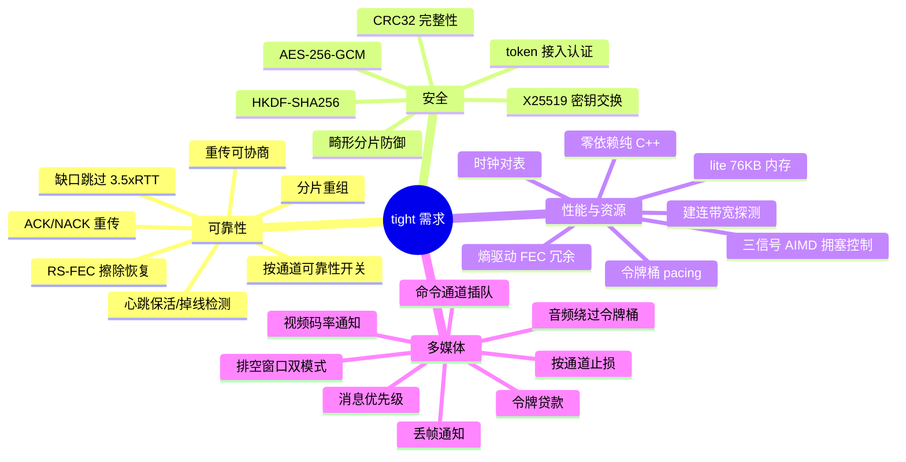
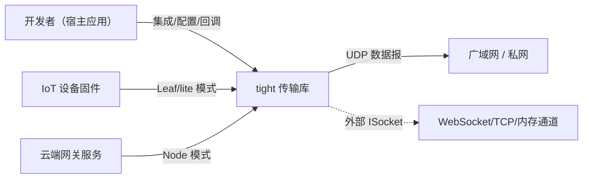
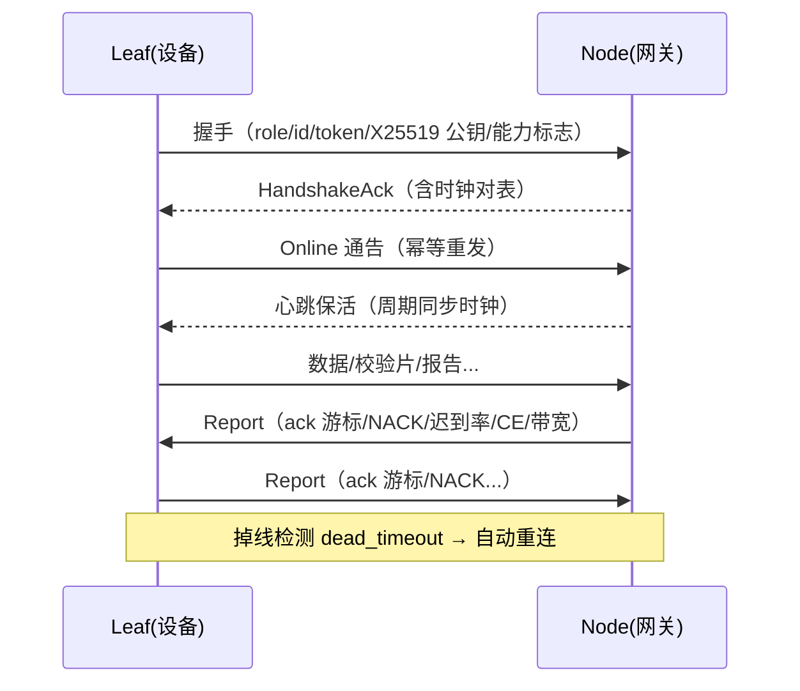

# tight — 需求描述文档（SRS）

> 文档类型：软件需求规格说明书（Software Requirements Specification）
> 适用范围：tight 可靠 UDP 传输协议库 v0.x
> 相关文档：[架构设计](architecture.md) · [设计要点](tight_design.md) · [使用文档](usage.md) · [API 参考](api_reference.md)

## 1. 概述

### 1.1 背景与问题

端云实时通信（IoT 设备 ↔ 云端网关）存在三类系统性矛盾：

1. **网络不可靠**：广域网丢包/抖动/乱序是常态，TCP 的队头阻塞不适用于实时音视频，裸 UDP 又无法保证可达与拥塞公平；
2. **端侧资源受限**：嵌入式设备 RAM/CPU/功耗紧张，通用传输栈（QUIC/WebRTC）体积与内存开销不可承受；
3. **业务负载混杂**：音频、视频、文件、命令在同一条链路上传输，需要不同的可靠性/延迟/优先级语义。

tight 的目标是提供**一份代码、两种模式**覆盖两侧：云端侧多并发（Node 模式），设备侧极低资源（Leaf / lite 模式），并针对实时媒体链路提供「可靠性与实时性兼得」的传输语义。

### 1.2 术语

| 术语 | 含义 |
|---|---|
| Node | 云端网关角色，接受多设备接入，资源充裕 |
| Leaf | 终端设备角色，主动连接网关，资源受限 |
| lite 模式 | Leaf 侧精简运行模式（单线程、低内存） |
| ARQ | 自动重传请求（ACK/NACK） |
| FEC | 前向纠错（Reed-Solomon 擦除码） |
| AIMD | 加性增乘性减（拥塞控制） |
| CE | Congestion Experienced（L4S/ECN 拥塞标记） |
| P50 | 报文到达延迟中位数 |

### 1.3 需求全景

## 2. 目标与非目标

### 2.1 目标（Goals）

- **G1** 在 20% 丢包率的广域网上维持实时音视频的可用体验（≤10 次重传 + FEC 在线恢复）；
- **G2** 设备端（lite 模式）空闲内存 ≤ 100KB，支持 64KB 小栈单线程运行；
- **G3** 弱网自适应：链路劣化时自动降速、给编码器可执行的码率预算，避免拥塞崩溃；
- **G4** 链路默认加密（X25519 + AES-256-GCM），接入需要 token 认证；
- **G5** 零第三方依赖、跨平台（Windows / Linux）、可嵌入宿主工程（单库接入）。

### 2.2 非目标（Non-Goals）

- 不实现应用层文件校验与断点续传策略（由宿主应用基于块校验 + 命令通道补发实现）；
- 不提供 WebRTC 兼容信令（协议自包含）；
- 不支持点对点 Mesh/广播拓扑（单对单连接，多端由 Node 侧多 Peer 管理）；
- 不承诺与传统 TCP 的公平性基准（面向实时媒体链路，采用 GCC 风格拥塞控制）。

## 3. 用户与使用场景

### 3.1 参与者（用例图）

### 3.2 典型场景

| 编号 | 场景 | 说明 |
|---|---|---|
| SC-1 | IoT 音频通话（设备→云端） | 16kHz 单声道 PCM 40ms 帧（1280B），整包承载，音频通道绕过令牌桶实时发送 |
| SC-2 | 实时视频回传（设备→云端） | 高码率视频流，FEC 低延迟路径，按 `video_capacity_bps` 通知自适应编码码率 |
| SC-3 | 文件/遥测可靠传输 | file/data 通道，per-channel ARQ 重传 + 消息去重 |
| SC-4 | 多设备汇聚网关 | Node 侧 5 线程并发承载多 Peer |
| SC-5 | 弱网自适应 | 链路劣化 → 降速 → 编码器降码率 → 恢复 |
| SC-6 | 自定义承载通道 | 通过 `ISocket` 注入 WebSocket/TCP/内存通道 |

### 3.3 典型时序（连接建立）

## 4. 功能需求（FR）

### 4.1 连接与生命周期

| 编号 | 需求 | 优先级 |
|---|---|---|
| FR-01 | 支持 Node/Leaf 两种角色；同一份代码两种模式运行 | P0 |
| FR-02 | 心跳保活（默认 5s）与掉线检测（`dead_timeout` 默认 30s） | P0 |
| FR-03 | 掉线后自动重连；Online 通告幂等重发 | P0 |
| FR-04 | 建连带宽探测（100KB 探测列车，可开关）与时钟对表 | P1 |
| FR-05 | `set_lite_mode()` 运行时切换精简模式 | P1 |

### 4.2 可靠性

| 编号 | 需求 | 优先级 |
|---|---|---|
| FR-10 | 消息按 MTU 分片（默认 1350，单包载荷 1286B）与重组 | P0 |
| FR-11 | ACK 确认 + NACK 重传：丢失序号每报告周期重复上报，每包最多重传 10 次 | P0 |
| FR-12 | 缺口超 3.5×RTT 自动跳过，ack 游标不停滞；迟到重传照常投递 | P0 |
| FR-13 | Reed-Solomon FEC（GF(2⁸)）动态冗余，缺片在线恢复 | P0 |
| FR-14 | 重传可协商：`retransmit_enabled` 经握手能力标志通告，任一端可单方面关闭 | P1 |
| FR-15 | per-channel ARQ：`channel_reliable[8]` 按通道开关重传（文件可靠、视频低延迟） | P0 |
| FR-16 | 命令通道单报文保序投递，乱序最多等 3×RTT 后跳号 | P0 |
| FR-17 | 心跳 + 时钟对表（握手 + 每次心跳） | P1 |

### 4.3 拥塞控制与码率

| 编号 | 需求 | 优先级 |
|---|---|---|
| FR-20 | 三信号 AIMD（GCC 风格）：delay（P50−RTprop）/ late（帧级迟到率）/ loss + CE 直接信号 | P0 |
| FR-21 | 令牌桶 pacing 出站；`btl` 下限 100kbps，提升上限 = 配置种子（默认 30Mbps） | P0 |
| FR-22 | 突刺门控：非持续超发不降速；持续超发按统一柔表降速（×0.50~0.90） | P0 |
| FR-23 | 恢复两步台阶 ×1.5（上限 = min(种子, recv×1.2)）；恢复需 <10ms 且 <0.5% | P0 |
| FR-24 | 建连带宽探测校准 `btl`（不超实测链路） | P1 |
| FR-25 | FEC 冗余率由迟到率信息熵 H(p)×1.2 动态驱动，上限 20%；RTT>200ms 或 CE>1% 自动关闭让出带宽 | P1 |
| FR-26 | `video_capacity_bps()` 码率通知：变化 >10% 且 >100kbps 回调（独立通知线程） | P0 |

### 4.4 多媒体语义

| 编号 | 需求 | 优先级 |
|---|---|---|
| FR-30 | 消息优先级调度：音频不被文件流阻塞；命令通道单报文保序插队 | P0 |
| FR-31 | 音频通道独立队列绕过令牌桶：实时音频无条件一次性发完 | P0 |
| FR-32 | 拥塞排空窗口双模式：fast（降幅 ≥35% → 清积压 + 请求关键帧）/ slow（降幅 ≥25% → Q 面积法 3s 温和排空） | P0 |
| FR-33 | 令牌贷款（`loan_seconds` 默认 5s）：视频可透支 btl×贷款秒数，超限硬止损 + `LoanExhaustedCallback` | P1 |
| FR-34 | `drain_channel()` 按通道止损；`clear_outbound()` 保留音频清空视频积压 | P1 |
| FR-35 | `message_loss_callback` 丢帧通知 + `late_buffer_ms` 动态迟到线 | P1 |

### 4.5 安全

| 编号 | 需求 | 优先级 |
|---|---|---|
| FR-40 | 握手 X25519 密钥交换（RFC 7748），HKDF-SHA256 派生会话密钥 | P0 |
| FR-41 | 数据面（Data/Parity/Command）AES-256-GCM 加密，报文头 AAD 绑定，可配置开关 | P0 |
| FR-42 | token 接入认证 + CRC32 完整性 + 畸形分片防御（`max_message_bytes`） | P0 |

### 4.6 资源与运行模式

| 编号 | 需求 | 优先级 |
|---|---|---|
| FR-50 | lite 模式：单线程 reactor（64KB 小栈），空闲实例 ~76KB | P0 |
| FR-51 | lite 业务画像：Audio（encode≤16/outbound≤32/socket≤4KB）/ Video（独立 receiver 双线程） | P1 |
| FR-52 | `fec_enabled` 全局开关：关闭后不生成/不解码校验片，省在途缓冲与 CPU | P1 |
| FR-53 | buffer_pool 出站零堆分配热点 | P1 |
| FR-54 | 外部 socket 注入（`ISocket`）：不创建/绑定/关闭 socket，入站推模型 `inject_packet()` | P1 |

### 4.7 可观测与测试

| 编号 | 需求 | 优先级 |
|---|---|---|
| FR-60 | 诊断接口：队列深度、带宽状态、在途统计 | P2 |
| FR-61 | 可脚本化内存链路测试环境（丢包/重复/延迟/乱序） | P0 |
| FR-62 | 单元测试覆盖加密标准向量（RFC/NIST）、FEC、AIMD、编解码 | P0 |

## 5. 非功能需求（NFR）

| 编号 | 需求 | 验收标准 |
|---|---|---|
| NFR-01 | 内存：普通模式空闲 ≤ 500KB；lite 模式空闲 ≤ 100KB | 空闲实例实测 ~460KB / ~76KB |
| NFR-02 | 内存（无重传在途）：与码率无关的常数 | 实测 ~24KB |
| NFR-03 | 延迟：报告周期 333ms（视频）~1s；排空节拍 10ms | 配置默认值即达标 |
| NFR-04 | CPU：lite 模式 flush_interval 自动 ≥10ms 省唤醒 | 配置钳制 |
| NFR-05 | 可靠性：20% 丢包下 FEC+ARQ 组合可恢复 | E2E 测试用例 |
| NFR-06 | 可移植性：Windows（MinGW/MSVC）与 Linux | 双平台 ctest 全绿 |
| NFR-07 | 依赖：零第三方运行时依赖 | 仅系统 socket + 线程库 |
| NFR-08 | 线程安全：公共 API 线程安全；应用回调不阻塞协议核心 | 回调在独立/专用线程执行 |
| NFR-09 | 可测试性：16 套件 / 152 用例 | ctest 全绿 |

## 6. 约束与依赖

| 约束 | 说明 |
|---|---|
| C-01 | 语言：C++17；公共头文件位于 `include/tight/` |
| C-02 | 传输：仅 UDP 数据报（IPv4/IPv6），MTU 默认 1350 |
| C-03 | 单连接单对端；Node 侧按 Peer 管理多连接 |
| C-04 | 报文头固定 48B；命令报文 ≤ MTU 单报 |
| C-05 | 系统依赖：Windows `ws2_32`；Linux POSIX socket；pthread |

## 7. 验收标准（对应实现与测试）

| 编号 | 验收项 | 验证方式 |
|---|---|---|
| AC-01 | 双平台构建通过 | `ctest --test-dir build`（16 套件/152 用例全绿） |
| AC-02 | 加密原语符合标准向量 | `test_crypto`（RFC 7748/5869、NIST GCM） |
| AC-03 | FEC 擦除恢复正确 | `test_fec` |
| AC-04 | AIMD 拥塞行为正确（降速/恢复/下限/pacer） | `test_bandwidth` |
| AC-05 | 端到端：ARQ/丢帧通知/FEC/exactly-once/文件/命令保序 | `test_transport_e2e` |
| AC-06 | lite 切换/排空/关加密/关 FEC/测速 | `test_transport_modes` |
| AC-07 | 外部 socket 注入（UDP 端到端） | `test_external_socket` |
| AC-08 | 资源档案符合 NFR-01/02 | 内存档案实测 |

## 8. 需求追溯矩阵（摘要）

| 需求 | 主要实现位置 | 测试 |
|---|---|---|
| FR-11/12/14/15 | `channel/report.cpp`、`core/transport.cpp` | test_report / test_transport_e2e |
| FR-13/25 | `fec/`、`channel/fragmenter.cpp` | test_fec / test_fragmenter |
| FR-20~26 | `core/bandwidth.cpp` | test_bandwidth |
| FR-30~35 | `core/transport.cpp`（通道/排空/贷款） | test_transport_modes |
| FR-40~42 | `crypto/` | test_crypto |
| FR-50~53 | `core/transport.cpp`、`util/` | test_transport_modes / test_buffer_pool |
| FR-54 | `include/tight/socket.hpp`、`core/transport.cpp` | test_external_socket |

## 9. 优先级与发布规划

